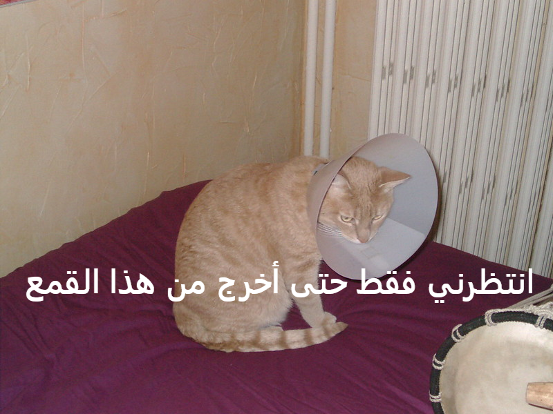

## ما الذي ستصنعه

في هذا المورد ، ستقوم بإنشاء مولد مقاطع مضحكة للقط. باستخدام صورة قطتك ، يمكنك إنشاء مقطع مضحك لقطتك لتتباهى به مع أصدقائك.

## ما الذي ستتعلمه

من خلال إنشاء مولد مقاطغ مضحكة للقط ستتعلم:

- كيفية كتابة الوظائف في جافا سكريبت
- كيفية استخدام JavaScript للتعامل مع إدخال البيانات من قبل المستخدم
- كيفية استخدام `الإدخال` و `التغيير` لجعل الأشياء تحدث مباشرة على صفحة الويب استجابة لإجراءات المستخدم

يغطي هذا المورد عناصر من السلاسل التالية من [Raspberry Pi Digital Making Curriculum](https://www.raspberrypi.org/curriculum/){: target = "_ blank"}:

- [تصميم الأصول الأساسية ثنائية الأبعاد وثلاثية الأبعاد](https://www.raspberrypi.org/curriculum/design/creator){:target="_blank"}
- [دمج بنيات البرمجة لحل المشكلة](https://www.raspberrypi.org/curriculum/programming/builder){: target = "_ blank"}
