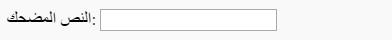

## الحصول على الصورة والنص

نريد أن يتمكن الأشخاص من استخدام صورهم ونصوصهم الخاصة لإنشاء المقاطع المضحكة، لذا نحتاج إلى طريقة لهم لتقديمها. دعنا نضيف نموذجًا يمكن للمستخدم تعبئته.

إذا كنت تستخدم ملفًا على جهاز الكمبيوتر ، فضع هذا الرمز بين `<body>` و `</body>`. إذا كنت تستخدم CodePen ، فضع هذا الرمز في قسم HTML.

- أضف العلامات `<form>،` التي تشير إلى بداية النموذج ، و `</form>،` التي تشير إلى نهاية النموذج.

    ```html
    <form>
    </form>
    ```

- داخل `<form>`، أضف مربع نص بحيث يمكنك كتابة النص المضحك:

  ```html
  <form>
  النص المضحك: <input type="text" id="user_text" maxlength="70"><p>
  </form>
  ```

- احفظ الرمز الخاص بك وقم بتحديث متصفحك لرؤية المربع الذي أنشأته.

    

- أضف رمزًا لإنشاء مربع إدخال آخر على السطر الموجود أسفل المربع الأول. هذه المرة لن يكون مربع الإدخال مربع نص ، بل مربع خاص لتحديد ملف الصورة للمقطع المضحك. يجب أن يكون نوع الإدخال `ملف`، ويجب أن يكون اسم الإدخال `user_picture`.

--- hints ---

--- hint ---

إليك ما يفعله الرمز الذي كتبته بالفعل:

  * `الإدخال` يقول إننا نقوم بإنشاء طريقة للمستخدم لتوفير بعض البيانات
  * `type = "text"` تقول أن البيانات ستكون نصية
  * `id = "user_text"` يعطي هذا المربع الخاص اسمًا أو معرفًا ، يشبه إلى حد ما اسم المتغير
  * `maxlength = "70"` اختيارية - يمنعك من الكتابة بأكثر من 70 حرفًا حتى لا يشغل النص الخاص بك مساحة بعد الجزء السفلي من الصورة
  * تضيف علامة `<p>` بعد مربع الإدخال فقرة (مساحة صغيرة قبل مربع الإدخال التالي)

هل يمكنك معرفة كيفية إنشاء مربع إدخال آخر باستخدام هذه المعلومات؟

--- /hint ---

--- hint ---

ستحتاج إلى تغيير أجزاء الكود المميزة بـ `***` أدناه:

```html
حدد صورة <input type="***" id="***"><p>
```

--- /hint ---

--- تلميح --- إليك الرمز الذي تريد إضافته:

```html
حدد صورة <input type="file" id="user_picture"><p>
```

--- /hint ---

--- /hints ---

- يمكنك استخدام هذه المربعات للكتابة وتحديد ملف ، ولكن لن يحدث شيء حتى الآن. **ملاحظة**: يتم الاحتفاظ بجميع الصور على جهاز الكمبيوتر الخاص بك - لا يقوم هذا البرنامج بتحميل أي شيء على الإنترنت.
