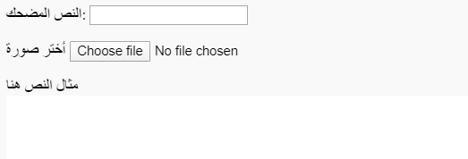
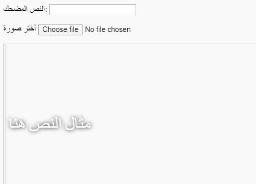

## أنشاء المقاطع المضحكة

نحن بحاجة الى انشاء منطقة حيث سيعرض المقطع المضحك. ستبدأ هذه المنطقة فارغة لأنه عندما يتم تحميل الصفحة لأول مرة ، لن نعرف الصورة أو النص الذي يريد الشخص استخدامه.

- تحت علامة `</form>` ، أضف سطرًا جديدًا من التعليمات البرمجية:

  ```html
  <div id="meme_text">نص مثال هنا</div>
  ```

  هذا عنصر `<div>` - إنه صندوق غير مرئي سيحتوي في النهاية على نص مضحك. لقد أعطيناها `معرف` مثلما فعلنا في مربعات الإدخال.

- الآن أضف `<div>` أسفل السابقة:

  ```html
    <div id="meme_picture">
    
    </div>
  ```

    داخل هذا `<div>`، هناك أيضًا علامة أخرى تعرض صورة. `src = ""` يشير إلى الصورة التي سيتم عرضها. في هذه الحالة ، تركنا الصورة فارغة ، لأنه ليس لدينا الصورة من المستخدم بعد.

- حفظ وتحديث. ستكون الصورة مربعًا فارغًا وسيظهر نص المثال بالخط الافتراضي ، وهو ليس مشابهًا جدًا للنص المضحك:

    

- إذا كنت تستخدم ملفًا على جهاز الكمبيوتر الخاص بك ، فابحث عن قسم `<head>` في الكود وأضف هذا الكود بين `<head>` و `</head>`. (تخط هذه الخطوة إذا كنت تستخدم CodePen.)

  ```html
  <style type="text/css">
  </style>
  ```

- قم بلصق الشفرة أدناه بين علامتي `<style>` لإعطاء النص نمط مضحك. إذا كنت تستخدم CodePen ، فضع هذا الرمز في قسم HTML.

    ```css
    #meme_text {
        background-color: transparent;
        font-size: 40px;
        font-family: "Impact";
        color: white;
        text-shadow: black 0px 0px 10px;
        width: 600px;
        position: absolute;
        left: 15px;
        top: 400px;
    }
    ```

  `اليسار: 15 بكسل` و `العلوي: 400 بكسل` أسطر تحدد المسافة بين النص من اليسار وأعلى الصفحة. يمكنك تغيير هذه الأرقام لجعل النص يظهر في مكان مختلف إذا أردت. إذا كنت ترغب في معرفة المزيد عن الأنماط CSS، بزيارة [w3schools CSS إشارة](http://www.w3schools.com/CSSref/){:target="_blank"}.

  
