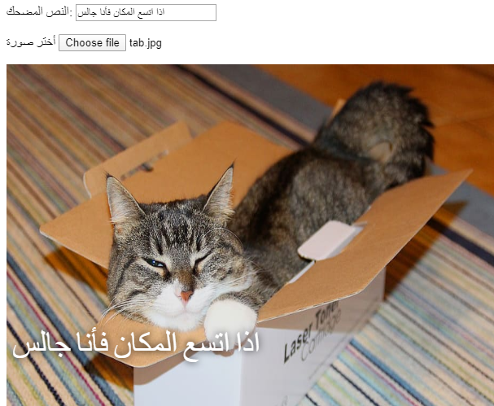

## عرض صورة

سنكتب الآن بعض التعليمات البرمجية لالتقاط صورة القط التي حددها المستخدم وعرضها على النص المضحك.

- حدد وظيفة JavaScript جديدة تسمى `update_image`. كن حذراً لكتابة هذا الرمز بعد قوس المجموعة `}` من الدالة السابقة التي أنشأتها.

[[[generic-javascript-create-a-function]]]

- داخل الدالة `update_image` ، أنشئ متغيرين جديدين:

    ```javascript
    var img = document.querySelector('img');
    ```

    يحدد هذا المتغير الأول العلامة الأولى (والوحيدة!) `` في المستند ، حتى نتمكن من إخبار الصفحة بمكان عرض الصورة المحددة.

    ```javascript
    var file = document.querySelector('input[type=file]').files[0];
    ```

    يشير هذا المتغير الثاني إلى ملف صورة القط المحدد.

- قم بتعيين علامة الصورة بحيث تحتوي على الصورة التي قام المستخدم بتحميلها:

    ```javascript
    img.src =  window.URL.createObjectURL(file);
    ```

- أضف الآن بعض التعليمات البرمجية لإخبار إدخال الملف لاستدعاء الوظيفة `update_image ()` `onchange` عندما يقوم شخص ما بتحديد ملف.

--- hints ---

--- hint ---
تذكر أنك، في الخطوة السابقة، قمت بتسمية الدالة `update_text()` عندما تم كتابة نص جديد في `user_text` مربع الإدخال. باستخدام ما تعلمته آنذاك، هل يمكنك البحث عن كيفية الاتصال بالدالة `update_image()` عندما يختار المستخدم ملف في مربع الادخال `user_file`؟ 

--- /hint ---

--- hint ---

ستحتاج إلى إضافة `onchange=""` ثم استبدال `***` بالوظيفة التي ترغب في استدعائها:

```javascript
حدد صورة <input type="file" id="user_picture" onchange="***">
```

--- /hint ---

--- hint ---

ابحث عن سطر التعليمات البرمجية لمربع إدخال الملف وأضف `onchange = "update_image ()"` مثل هذا:

```html
أختر صورة <input type="file" id="user_picture" onchange="update_image()">
```

--- /hint ---

--- /hints ---

- حفظ وتحديث الصفحة. إذا كان الرمز الخاص بك يعمل ، عند تحديد صورة باستخدام مربع الإدخال **أختر صورة** ، يجب أن تظهر تلك الصورة في مربع الميم أدناه. إذا قمت أيضًا بكتابة شيء ما في مربع النص ، فيجب أن يظهر النص المضحك الخاص بك أعلى الصورة.


