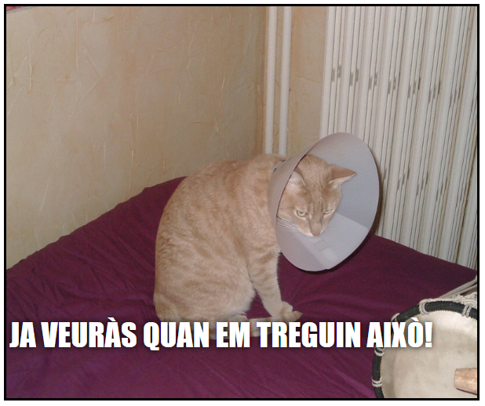

## Què faràs

En aquest projecte crearàs un generador de mem de gat. Fent servir una imatge del teu gat, pots crear el teu propi mem de gat per mostrar-lo als teus amics.

## Què aprendràs

Creant un generador de mem de gat, aprendràs:

- Com escriure funcions en JavaScript
- Com utilitzar JavaScript per manipular l’entrada de dades d’un usuari
- Com utilitzar `oninput` i `onchange` per fer que les coses passin en temps real en una pàgina web en resposta a les accions dels usuaris

Aquest projecte tracta elements dels següents aspectes del [Currículum de Fabricació Digital de Raspberry Pi](https://www.raspberrypi.org/curriculum/){:target="_blank"}:

- [Disseny d'eines elementals en 2D i 3D](https://www.raspberrypi.org/curriculum/design/creator){:target="_blank"}
- [Combina construccions de programació per resoldre un problema](https://www.raspberrypi.org/curriculum/programming/builder){:target="_ blank"}
