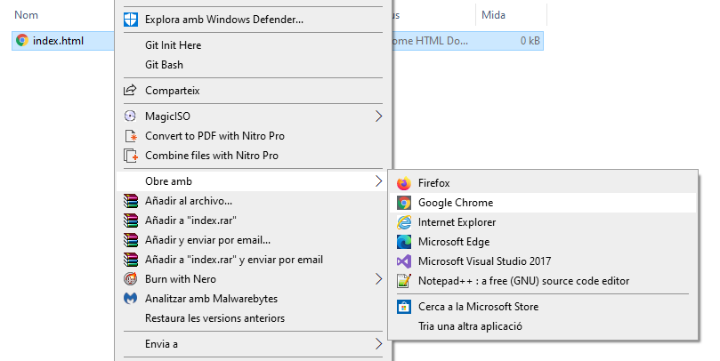

## Crea una pàgina web

- Obre un fitxer en blanc a l’editor de text escollit i desa'l.

[[[generic-html-create-and-save]]]

- El codi HTML següent et proporciona l'estructura bàsica d'una pàgina. Copia'l i enganxa'l al fitxer que has creat i, a continuació, desa el fitxer. Mantén l’editor de text obert perquè puguis editar el fitxer.

  ```html
  <html>
  <head>
    <title>My page</title>
  </head>
  <body>
    My content here
  </body>
  </html>
  ```

- Vés a la carpeta on has desat la teva pàgina web. Obre també el fitxer amb el teu navegador d’internet, de manera que tinguis el mateix fitxer obert tant a l’editor de text com al navegador.

  A Windows, potser hauràs de fer clic amb el botó dret sobre el fitxer, escollir `Obre amb` i, a continuació, seleccionar el navegador d’internet.

  

  Sempre que canviïs el codi al teu editor de text, desa'l i, a continuació, prem el botó de refrescar del navegador per veure la pàgina actualitzada.
