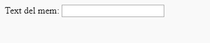

## Obtenció de la imatge i el text

Volem que la gent pugui utilitzar la seva pròpia imatge i text per construir el mem, per la qual cosa necessitem una manera de proporcionar-los. Afegim un formulari que el nostre usuari pugui omplir.

Si utilitzes un fitxer al teu ordinador, posa aquest codi entre `<body>` i `</body>`. Si utilitzes CodePen, posa aquest codi a la secció HTML.

- Afegeix les etiquetes `<form>,` que indica l’inici del formulari i `</form>,` que indica el final del formulari.

    ```html
    <form>
    </form>
    ```

- Dins el teu `<form>`, afegeix un requadre de text per tal que puguis escriure-hi el text del mem:

  ```html
  <form>
  Text de mem: <input type="text" id="user_text" maxlength="70"><p>
  </form>
  ```

- Desa el codi i refresca el navegador per veure el requadre que has creat.

    

- Afegeix codi per crear un altre requadre d’entrada a la línia que hi ha a sota del primer requadre. Aquesta vegada, el requadre d’entrada no serà un requadre de text, sinó un requadre especial per seleccionar el fitxer d’imatge del mem. El tipus d’entrada hauria de ser `fitxer` i el nom de l’entrada hauria de ser `user_picture`.

--- hints ---

--- hint --- Aquí tens el que fa el codi que has escrit:

  * `input` diu que estem creant una manera perquè l’usuari proporcioni algunes dades
  * `type="text"` diu que les dades seran de text
  * `id="user_text"` dóna a aquest requadre en concret un nom o un ID (identificador), semblant a un nom de variable
  * `maxlength="70"`, longitud màxima, és opcional: impedeix que escriguis més de 70 lletres de manera que el teu text no ocupi espai més enllà del final de la imatge
  * L’etiqueta `<p>` després del requadre d’entrada afegeix un paràgraf (una mica d’espai abans del següent requadre d’entrada)

Pots esbrinar com es pot crear un altre requadre d’entrada mitjançant aquesta informació?

--- /hint ---

--- hint ---

Has de canviar les parts ressaltades del codi amb `***` que venen a continuació:

```html
Tria una imatge <input type="***" id="***"><p>
```

--- /hint ---

--- hint --- Aquí tens el codi que has d'afegir:

```html
Tria una imatge <input type="file" id="user_picture"><p>
```
--- /hint ---

--- /hints ---

- Pots fer servir aquests requadres per escriure i triar un fitxer, però encara no passarà res. **Nota**: totes les imatges es conserven a l’ordinador - aquest programa no penja res a Internet.
