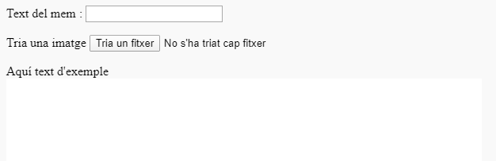
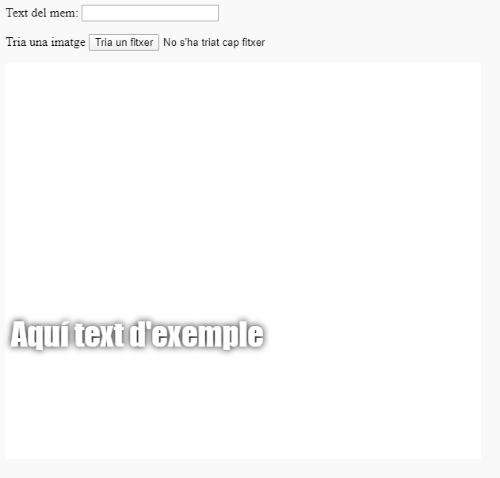

## Construeix el mem

Hem de crear una àrea on es mostri el mem. Aquesta àrea començarà en blanc, ja que quan es carregui la pàgina per primera vegada, no sabem quina imatge o text vol l'usuari.

- A sota de l'etiqueta `</form>`, afegeix una línia nova de codi:

  ```html
  <div id="meme_text">Aquí text d'exemple</div>
  ```

  Aquest és un element `<div>`: és un requadre invisible que temporalment contindrà el text per al nostre mem. Li hem donat un `id` de la mateixa manera que ho vas fer als requadres d’entrada.

- Ara afegeix un altre `<div>` per sota de l’anterior:

  ```html
    <div id="meme_picture"></div>
    ```

    Dins d'aquest `<div>`, també hi ha una altra etiqueta que mostra una imatge. `src=""` indica quina imatge cal mostrar. En aquest cas, hem deixat la imatge en blanc, perquè encara no tenim la imatge de l’usuari.

- Desa i actualitza. La imatge serà un requadre en blanc i el text d’exemple es mostrarà en el tipus de lletra per defecte, que no s’assembla gaire a un mem:

    

- Si utilitzes un fitxer al teu ordinador, busca la secció `<head>` del teu codi i afegeix aquest codi entre `<head>` i `</head>`. (Omet aquest pas si utilitzes CodePen.)

  ```html
  <style type="text/css">
  </style>
  ```

- Enganxa el codi següent entre les etiquetes `<style>` per donar al teu text un estil de mem. Si utilitzes CodePen, enganxa'l a la secció CSS.

    ```css
    #meme_text {
        background-color: transparent;
        font-size: 40px;
        font-family: "Impact";
        color: white;
        text-shadow: black 0px 0px 10px;
        width: 600px;
        position: absolute;
        left: 15px;
        top: 400px;
    }
    ```

  Les línies `left: 15px` i `top: 400px` determinen a quina distància es troba el text de l'esquerra i de la part superior de la pàgina. Si vols, pots canviar aquests números per fer que el text aparegui en un lloc diferent del mem. Si vols més informació sobre els estils CSS, visita la [referència CSS de w3schools](http://www.w3schools.com/CSSref/){:target="_blank"}.

  
