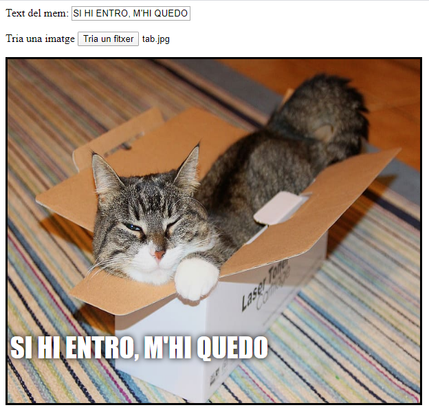

## Mostra la imatge

Ara escriurem algun codi per tal que la imatge de gat que l’usuari hagi triat es mostri al mem.

- Defineix una funció de JavaScript nova que es digui `actualitzar_imatge`. Ves en compte d'escriure aquest codi després de la clau final `}` de la funció anterior que has creat.

[[[generic-javascript-create-a-function]]]

- Dins la funció `actualitzar_imatge`, crea dues variables noves:

    ```javascript
    var img = document.querySelector('img');
    ```

    Aquesta primera variable selecciona la primera etiqueta (i només aquesta!) `` del document, de manera que puguem dir a la pàgina on mostrar la imatge escollida.

    ```javascript
    var fitxer = document.querySelector('input[type=file]').files[0];
    ```

    Aquesta segona variable apunta al fitxer de la imatge del gat seleccionat.

- Assigna a l'etiqueta imatge perquè contingui la imatge que l'usuari ha penjat:

    ```javascript
    img.src =  window.URL.createObjectURL(fitxer);
    ```

- Ara afegeix codi per dir-li a l'entrada de fitxer que cridi a la funció `actualitzar_imatge ()` `onchange`quan algú tria un fitxer.

--- hints ---

--- hint --- Recorda que, al pas anterior, has cridat a la funció `actualitzar_text ()` quan s'ha escrit text nou al requadre d'entrada `user_text`. Utilitzant allò que has après, pots esbrinar com cridar la funció `actualitzar_imatge()` quan l’usuari tria un fitxer al requadre d'entrada `user_file`? --- /hint ---

--- hint --- Hauràs d'afegir `onchange=""` i canviar `***` per la funció que t'agradaria cridar:
```javascript
Tria una imatge <input type="file" id="user_picture" onchange="***">
```
--- /hint ---

--- hint --- Cerca la línia de codi del requadre de selecció de fitxer i afegeix `onchange="actualitzar_imatge()"` com tens aquí:
```html
Tria una imatge <input type="file" id="user_picture" onchange="update_image()">
```

--- /hint ---

--- /hints ---

- Desa i actualitza la pàgina. Si el teu codi funciona, quan tries una imatge mitjançant el requadre d'entrada **Tria una imatge**, la imatge hauria d'aparèixer al requadre del mem de sota. Si també escrius alguna cosa al requadre de text, el text del mem hauria d'aparèixer a la part superior de la imatge.


