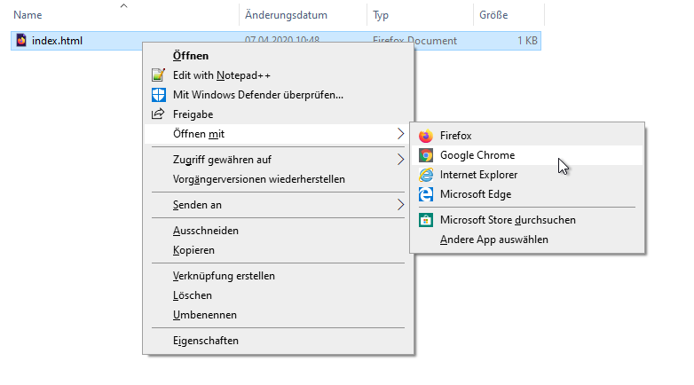

## Erstelle eine Webseite

- Öffne eine leere Datei in einem Texteditor deiner Wahl und speichere die Datei.

[[[generic-html-create-and-save]]]

- Der folgende HTML-Code zeigt dir die Grundstruktur einer Seite. Kopiere ihn und füge ihn in die von dir erstellte Datei ein. Speichere dann die Datei. Lasse den Texteditor geöffnet, damit du die Datei bearbeiten kannst.

  ```html
  <html>
  <head>
    <title>Meine Seite</title>
  </head>
  <body>
    Mein Inhalt hier
  </body>
  </html>
  ```

- Gehe zu dem Ordner, in dem du deine Webseite gespeichert hast. Öffne die Datei auch mit deinem Internetbrowser, sodass du sowohl in deinem Texteditor als auch in deinem Browser dieselbe Datei geöffnet hast.

  Unter Windows musst du möglicherweise mit der rechten Maustaste auf die Datei klicken, `Öffnen mit` auswählen und dann deinen Internetbrowser auswählen.

  

  Wann immer du den Code in deinem Texteditor änderst, speichere ihn und drücke die Aktualisierungstaste in deinem Browser, um die aktualisierte Seite anzuzeigen.
