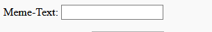

## An Bild und Text kommen

Wir möchten, dass die Leute ihr eigenes Bild und ihren eigenen Text verwenden können, um das Meme zu erstellen. Deshalb müssen wir ihnen eine Möglichkeit geben uns diese bereitzustellen. Fügen wir ein Formular hinzu, das unser Benutzer ausfüllen kann.

Wenn du eine Datei auf deinem Computer verwendest, setze diesen Code zwischen `<body>` und `</body>`. Wenn du CodePen verwendest, füge diesen Code in den HTML-Abschnitt ein.

- Füge die Tags `<form>`, das den Beginn des Formulars andeutet, und `</form>`, das das Ende des Formulars andeutet, hinzu.

    ```html
    <form>
    </form>
    ```

- Füge in dein "`<form>`" ein Textfeld ein, damit du den Meme-Text eingeben kannst:

  ```html
  <form>
  Meme-Text: <input type="text" id="user_text" maxlength="70"><p>
  </form>
  ```

- Speichere deinen Code und aktualisiere deinen Browser, um das von dir erstellte Feld anzuzeigen.

    

- Füge Code hinzu, um ein weiteres Eingabefeld in der Zeile unter deinem ersten Feld zu erstellen. Dieses Mal ist das Eingabefeld kein Textfeld, sondern ein spezielles Feld zur Auswahl der Bilddatei für das Meme. Der Eingabetyp sollte `file` (englisch für Datei) und der Name des Eingabe sollte `user_picture` (englisch "user" für Benutzer und "picture" für Bild) sein.

--- hints ---

--- hint --- Der Code, den du bereits geschrieben hast, tut folgendes:

  * `input` besagt, dass wir eine Möglichkeit für den Benutzer schaffen, einige Daten bereitzustellen
  * `type="text"` gibt an, dass die Daten Text sind
  * `id="user_text"` gibt diesem bestimmten Feld einen Namen oder eine ID, ähnlich einem Variablennamen
  * `maxlength="70"` ist optional - es verhindert, dass du mehr als 70 Buchstaben eingibst, damit dein Text keinen Platz unter dem unteren Bildrand einnimmt
  * Das `<p>`-Tag nach dem Eingabefeld fügt einen Absatz hinzu (etwas Platz vor dem nächsten Eingabefeld)

Can you work out how to create another input box using this information?

--- /hint ---

--- hint ---

You will need to change the parts of the code highlighted with `***` below:

```html
Select a picture <input type="***" id="***"><p>
```

--- /hint ---

--- hint --- Here is the code you need to add:

```html
Select a picture <input type="file" id="user_picture"><p>
```
--- /hint ---

--- /hints ---

- You can use these boxes to type into and to select a file, but nothing will happen yet. **Note**: all images are kept on your computer - this program does not upload anything to the internet.
