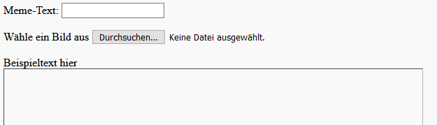
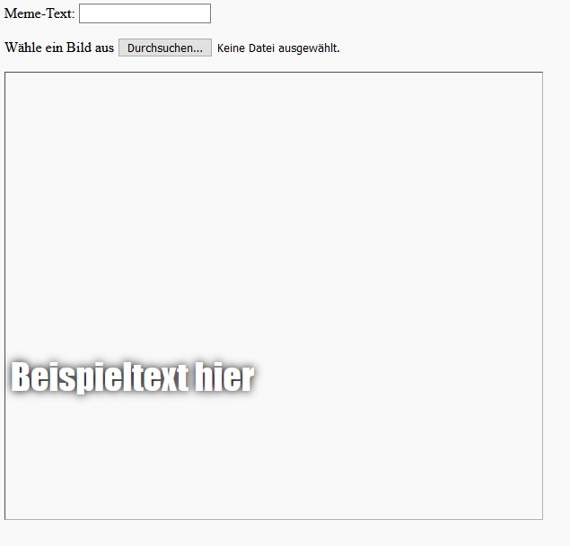

## Baue das Meme

Wir müssen einen Bereich erstellen, in dem das Meme angezeigt wird. Dieser Bereich wird zu Beginn leer sein, denn wenn die Seite zum ersten Mal geladen wird, wissen wir nicht, welches Bild oder welchen Text die Person verwenden möchte.

- Füge unter dem `</form>`-Tag eine neue Codezeile hinzu:

  ```html
  <div id="meme_text">Beispieltext hier</div>
  ```

  Dies ist ein `<div>`-Element - es ist eine unsichtbare Box, die schließlich den Text für unser Meme enthält. Wir haben ihm eine `-id` gegeben, genau wie wir es mit den Eingabefeldern getan haben.

- Füge nun ein weiteres `<div>` unter dem vorherigen hinzu:

  ```html
    <div id="meme_picture"></div>
    ```

    In diesem `<div>` ist noch ein weiteres Tag, das ein Bild anzeigt. `src=""` gibt an, welches Bild angezeigt werden soll. In diesem Fall haben wir das Bild leer gelassen, weil wir das Bild vom Benutzer noch nicht haben.

- Speichere und aktualisiere. Das Bild wird ein leeres Feld sein und der Beispieltext wird in der Standardschriftart angezeigt, was nicht sehr meme-like ist:

    

- Wenn du eine Datei auf deinem Computer verwendest, suche den `<head>` Abschnitt in deinem Code und füge diesen Code zwischen `<head>` und `</head>` ein. (Überspringe diesen Schritt, falls du CodePen verwendest.)

  ```html
  <style type="text/css">
  </style>
  ```

- Füge den folgenden Code zwischen den `<style>` Tags ein, um deinem Text einen Meme-Stil zu geben. Wenn du CodePen verwendest, füge diesen Code in den CSS-Abschnitt ein.

    ```css
    #meme_text {
        background-color: transparent;
        font-size: 40px;
        font-family: "Impact";
        color: white;
        text-shadow: black 0px 0px 10px;
        width: 600px;
        position: absolute;
        left: 15px;
        top: 400px;
    }
    ```

  Die Zeilen `left: 15px` und `top: 400px` bestimmen, wie weit der Text vom linken und oberen Rand der Seite entfernt ist. Wenn du willst, kannst du diese Zahlen ändern, um den Text an einer anderen Stelle auf deinem Meme zu platzieren. Wenn du mehr über "CSS-Styles" erfahren möchtest, besuche die [w3schools CSS-Referenz](http://www.w3schools.com/CSSref/){:target="_blank"}.

  
