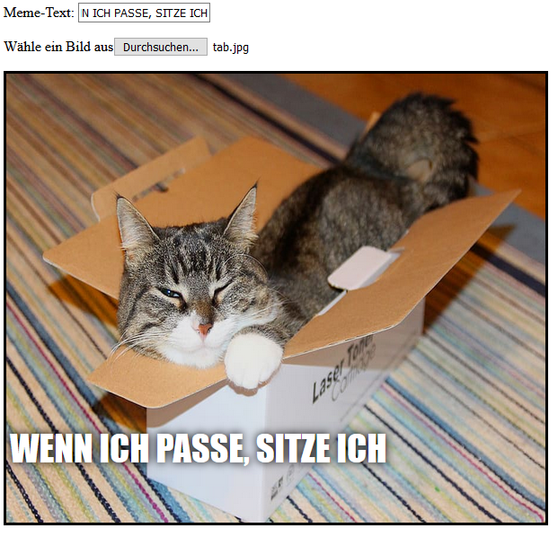

## Das Bild anzeigen

Wir werden nun Code schreiben, um das vom Benutzer ausgewählte Katzenbild zu nehmen und im Meme anzuzeigen.

- Definiere eine neue JavaScript-Funktion namens `update-image`. Achte darauf diesen Code nach der schließenden geschwungenen Klammer `}`, der Funktion die du vorher erstellt hast, zu schreiben.

[[[generic-javascript-create-a-function]]]

- Erstelle innerhalb der `update_image` Funktion zwei neue Variablen:

    ```javascript
    var img = document.querySelector('img');
    ```

    Diese erste Variable wählt das erste (und einzige!) ``-Tag im Dokument aus, damit wir der Seite mitteilen können, wo das ausgewählte Bild angezeigt werden soll.

    ```javascript
    var file = document.querySelector('input[type=file]').files[0];
    ```

    Diese zweite Variable verweist auf die ausgewählte Katzenbilddatei.

- Stelle das Bild- (img-) Tag so ein, dass es das Bild enthält, welches der Benutzer hochgeladen hat:

    ```javascript
    img.src =  window.URL.createObjectURL(file);
    ```

- Füge nun Code hinzu um dem Datei-Input-Feld mitzuteilen, dass es bei einer Änderung (englisch: `onchange`) die `update_image()` Funktion aufrufen soll, wenn jemand eine Datei auswählt.

--- hints ---

--- hint --- Erinnere dich daran, dass du, im vorherigen Schritt, eine Funktion `update_text()` aufgerufen hast, wann immer neuer Text in das `user_text`-Eingabefeld geschrieben wurde. Kannst du anhand dessen, was du dabei gelernt hast herausfinden, wie du die Funktion `update_image()` aufrufst, wenn der Benutzer eine Datei im `user_file`-Eingabefeld auswählt? --- /hint ---

--- hint --- Du musst `onchange=""` hinzufügen und dann die`***` durch die Funktion ersetzen, die du aufrufen möchtest:
```javascript
Wähle ein Bild aus <input type="file" id="user_picture" onchange="***">
```
--- /hint ---

--- hint --- Finde die Codezeile für das Datei-Eingabefeld und füge `onchange="update_image()"` wie folgt hinzu:
```html
Wähle ein Bild aus <input type="file" id="user_picture" onchange="update_image()">
```

--- /hint ---

---/hints ---

- Speichere und lade die Seite neu. Wenn dein Code funktioniert, sollte, sobald du ein Bild über das **Wähle ein Bild aus**-Eingabefeld auswählst, dieses Bild in der Meme-Box unten angezeigt werden. Wenn du außerdem noch etwas in das Textfeld eingibst, sollte dein Meme-Text auf dem Bild erscheinen.


