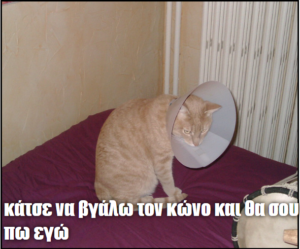

## Τι θα φτιάξεις

Σε αυτόν τον πόρο θα δημιουργήσεις μια γεννήτρια για memes με γάτες. Χρησιμοποιώντας μια εικόνα της γάτας σου, μπορείς να δημιουργήσεις το δικό σου meme γάτας για να το δείξεις στους φίλους σου.

## Τι θα μάθεις

Με τη δημιουργία μιας γεννήτριας memes με γάτες θα μάθεις:

- Πώς να γράψεις συναρτήσεις στη JavaScript
- Πώς να χρησιμοποιήσεις τη JavaScript για να χειριστείς την εισαγωγή δεδομένων από έναν χρήστη
- Πώς να χρησιμοποιήσεις τα `oninput` και `onchange` για να κάνεις μια ιστοσελίδα να προσαρμόζεται ζωντανά ως απάντηση στις ενέργειες του χρήστη

Αυτός ο πόρος καλύπτει στοιχεία από τα ακόλουθα σκέλη του μαθήματος [Raspberry Pi Digital Making](https://www.raspberrypi.org/curriculum/){:target="_ blank"}:

- [Σχεδιασμός βασικών στοιχείων 2D και 3D](https://www.raspberrypi.org/curriculum/design/creator){:target="_blank"}
- [Συνδύασε δομές προγραμματισμού για να λύσεις ένα πρόβλημα](https://www.raspberrypi.org/curriculum/programming/builder){:target="_blank"}
