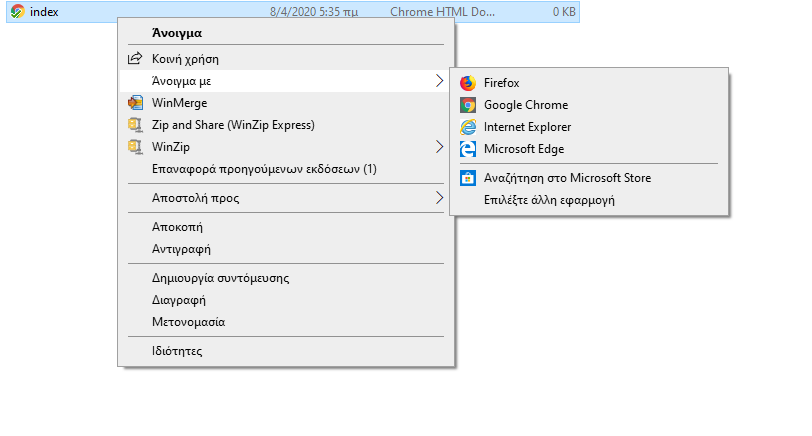

## Δημιουργία μιας ιστοσελίδας

- Άνοιξε ένα κενό αρχείο στον επεξεργαστή κειμένου που έχεις επιλέξει και αποθήκευσε το αρχείο.

[[[generic-html-create-and-save]]]

- Ο παρακάτω κώδικας HTML σου δίνει τη βασική δομή μιας σελίδας. Αντέγραψε και επικόλλησέ το στο αρχείο που δημιούργησες και στη συνέχεια αποθήκευσε το αρχείο. Κράτησε το πρόγραμμα επεξεργασίας κειμένου ανοιχτό για να μπορείς να επεξεργαστείς το αρχείο.

  ```html
  <html>
  <head>
    <title>Η σελίδα μου</title>
  </head>
  <body>
    Το περιεχόμενό μου εδώ
  </body>
  </html>
  ```

- Πήγαινε στο φάκελο στον οποίο αποθήκευσες την ιστοσελίδα σου. Άνοιξε το αρχείο με το πρόγραμμα περιήγησης στο Internet, έτσι ώστε να έχεις το ίδιο αρχείο ανοιχτό και στον επεξεργαστή κειμένου σου και στον browser σου.

  Στα Windows, ίσως χρειαστεί να κάνεις δεξί κλικ στο αρχείο, να επιλέξεις `Άνοιγμα με` και στη συνέχεια να επιλέξεις το πρόγραμμα περιήγησης στο Internet.

  

  Κάθε φορά που αλλάζεις τον κώδικα στον επεξεργαστή κειμένου, αποθήκευσέ τον και, στη συνέχεια, πάτησε το κουμπί ανανέωσης στο πρόγραμμα περιήγησής σου για να δεις την ενημερωμένη σελίδα.
