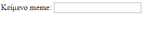

## Λήψη της εικόνας και του κειμένου

Θέλουμε οι άνθρωποι να μπορούν να χρησιμοποιούν τη δική τους εικόνα και το κείμενο για να κάνουν το meme, γι΄ αυτό χρειαζόμαστε έναν τρόπο που να τους τα παρέχει. Ας προσθέσουμε μια φόρμα που μπορεί να συμπληρώσει ο χρήστης μας.

Αν χρησιμοποιείς ένα αρχείο στον υπολογιστή σου, τοποθέτησε αυτόν τον κώδικα μεταξύ `<body>` και `</body>`. Εάν χρησιμοποιείς το CodePen, τοποθέτησε αυτόν τον κώδικα στην ενότητα HTML.

- Πρόσθεσε τις ετικέτες `<form>`, που δηλώνει την αρχή της φόρμας και `</form>`, που δηλώνει το τέλος της φόρμας.

    ```html
    <form>
    </form>
    ```

- Μέσα στο `<form>`, πρόσθεσε ένα πλαίσιο κειμένου ώστε να μπορείς να πληκτρολογήσεις το κείμενο του meme:

  ```html
  <form>
  Κείμενο meme: <input type="text" id="user_text" maxlength="70"><p>
  </form>
  ```

- Αποθήκευσε τον κώδικά σου και ανανέωσε το πρόγραμμα περιήγησής σου για να δες το πλαίσιο που δημιούργησες.

    

- Πρόσθεσε κώδικα για να δημιουργήσεις ένα άλλο πλαίσιο εισαγωγής στη γραμμή κάτω από το πρώτο σου πλαίσιο. Αυτή τη φορά το πλαίσιο εισαγωγής δεν θα είναι ένα πλαίσιο κειμένου, αλλά ένα ειδικό πλαίσιο για την επιλογή του αρχείου εικόνας για το meme. Ο τύπος εισόδου πρέπει να είναι `αρχείο` και το όνομα της εισόδου πρέπει να είναι `user_picture`.

--- hints ---


--- hint --- Ο κώδικας που ήδη έγραψες περιγράφεται παρακάτω:

  * Το `input` δηλώνει ότι δημιουργούμε έναν τρόπο για τον χρήστη να παράσχει κάποια δεδομένα
  * Το `type="text"` λέει ότι τα δεδομένα θα είναι κείμενο
  * Το `id="user_text"` δίνει σε αυτό το συγκεκριμένο πλαίσιο ένα όνομα ή αναγνωριστικό, κάτι σαν ένα όνομα μεταβλητής
  * Το `maxlength="70"` είναι προαιρετικό - σε εμποδίζει να πληκτρολογήσεις περισσότερα από 70 γράμματα, έτσι ώστε το κείμενό σου να μην ξεφεύγει από το κάτω μέρος της εικόνας
  * Η ετικέτα `<p>` μετά το πλαίσιο εισαγωγής προσθέτει μια παράγραφο (λίγο χώρο πριν το επόμενο πλαίσιο εισαγωγής)

Μπορείς να δοκιμάσεις να δημιουργήσεις ακόμη ένα πλαίσιο εισαγωγής χρησιμοποιώντας αυτές τις πληροφορίες;

--- /hint ---

--- hint ---

Θα χρειαστεί να αλλάξεις τα τμήματα του κώδικα που επισημαίνονται με `***` παρακάτω:

```html
Επέλεξε μια εικόνα <input type="***" id="***"><p>
```

--- /hint ---

--- hint --- Εδώ είναι ο κώδικας που πρέπει να προσθέσεις:

```html
Επέλεξε μια εικόνα <input type="file" id="user_picture"><p>
```
--- /hint ---

--- /hints ---

- Μπορείς να χρησιμοποιήσεις αυτά τα πλαίσια για να πληκτρολογήσεις και να επιλέξεις ένα αρχείο, αλλά τίποτα δεν θα συμβεί ακόμα. **Σημείωση**: όλες οι εικόνες διατηρούνται στον υπολογιστή σου - αυτό το πρόγραμμα δεν ανεβάζει τίποτα στο διαδίκτυο.
