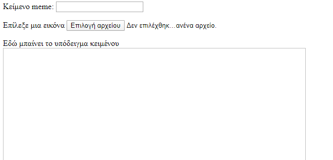
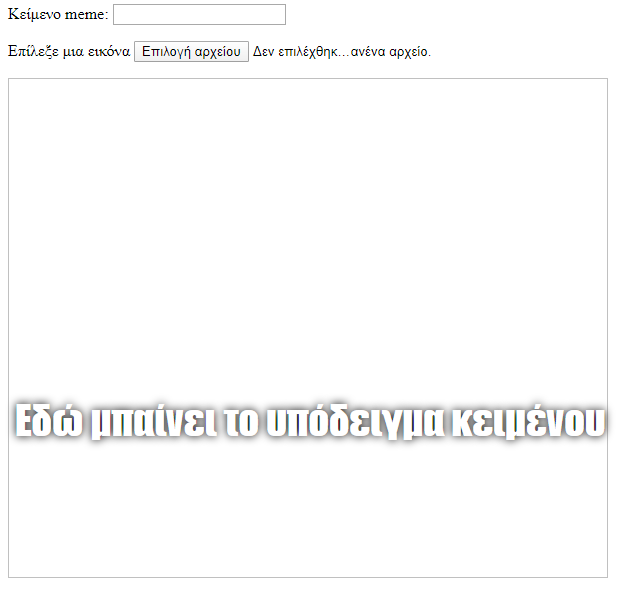

## Δημιουργία του meme

Χρειάζεται να δημιουργήσουμε μια περιοχή όπου θα εμφανίζεται το meme. Αυτή η περιοχή θα ξεκινήσει κενή, επειδή όταν αρχίσει η φόρτωση της σελίδας, δεν θα γνωρίζουμε ποια εικόνα ή κείμενο θέλει να χρησιμοποιήσει ο χρήστης.

- Κάτω από την ετικέτα `</form>`, πρόσθεσε μια νέα γραμμή κώδικα:

  ```html
  <div id="meme_text">Εδώ μπαίνει το υπόδειγμα κειμένου</div>
  ```

  Αυτό είναι ένα αντικείμενο `<div>` - είναι ένα αόρατο κουτί στο οποίο θα τοποθετηθεί τελικά το κείμενο για το meme μας. Του έχουμε δώσει ένα `id` όπως ακριβώς κάναμε και στα πλαίσια εισαγωγής.

- Τώρα πρόσθεσε ακόμη ένα `<div>` κάτω από το προηγούμενο:

  ```html
    <div id="meme_picture"></div>
    ```

    Μέσα σε αυτό το `<div>`, υπάρχει επίσης μια άλλη ετικέτα που εμφανίζει μια εικόνα. Το `src=""` υποδεικνύει ποια εικόνα θα εμφανιστεί. Σε αυτήν την περίπτωση, αφήσαμε την εικόνα κενή, επειδή δεν έχουμε ακόμα την εικόνα από το χρήστη.

- Αποθήκευσε και ανανέωσε. Η εικόνα θα είναι ένα κενό πλαίσιο και το κείμενο του παραδείγματος θα εμφανιστεί στην προεπιλεγμένη γραμματοσειρά, η οποία δεν θυμίζει και πολύ γραμματοσειρά για meme:

    

- Εάν χρησιμοποιείς αρχείο στον υπολογιστή σου, εντόπισε την `<head>` ενότητα στον κώδικά σου και πρόσθεσε αυτόν τον κώδικα μεταξύ `<head>` και `</head>`. (Παράλειψε αυτό το βήμα αν χρησιμοποιείς το CodePen.)

  ```html
  <style type="text/css">
  </style>
  ```

- Επικόλλησε τον παρακάτω κώδικα μεταξύ των ετικετών `<style>` για να δώσεις στο κείμενό σου το στυλ ενός meme. Εάν χρησιμοποιείς το CodePen, επικόλλησε αυτόν τον κώδικα στην ενότητα HTML.

    ```css
    #meme_text {
        background-color: transparent;
        font-size: 40px;
        font-family: "Impact";
        color: white;
        text-shadow: black 0px 0px 10px;
        width: 600px;
        position: absolute;
        left: 15px;
        top: 400px;
    }
    ```

  Οι γραμμές `left: 15px` και `top: 400px` καθορίζουν πόσο μακριά είναι το κείμενο από το αριστερό και το επάνω μέρος της σελίδας. Μπορείς να αλλάξεις αυτούς τους αριθμούς, για να κάνεις το κείμενο να εμφανίζεται σε διαφορετικό σημείο στο meme σου, αν θέλεις. Αν θέλεις να μάθεις περισσότερα για τα στυλ CSS, επισκέψου το [w3schools CSS](http://www.w3schools.com/CSSref/){:target="_blank"}.

  
