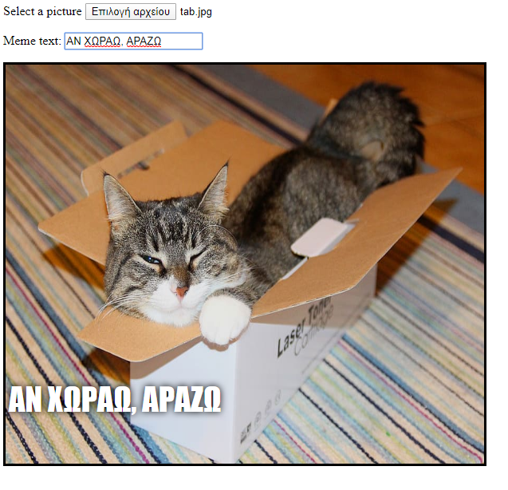

## Εμφάνιση εικόνας

Θα γράψουμε τώρα κώδικα για να πάρουμε την εικόνα γάτας που έχει επιλέξει ο χρήστης και να την εμφανίσουμε στο meme.

- Όρισε μια νέα συνάρτηση JavaScript που ονομάζεται `update_image`. Πρόσεξε να πληκτρολογήσεις αυτόν τον κώδικα μετά το κλείσιμο του άγκιστρου `} ` της προηγούμενης συνάρτησης που δημιούργησες.

[[[generic-javascript-create-a-function]]]

- Μέσα στο `update_image`, δημιούργησε δύο νέες μεταβλητές:

    ```javascript
    var img = document.querySelector('img');
    ```

    Αυτή η πρώτη μεταβλητή επιλέγει το πρώτο (και μοναδικό!) `` tag στο έγγραφο, έτσι ώστε να περιγράψουμε στη σελίδα πού να εμφανίσει την επιλεγμένη εικόνα.

    ```javascript
    var file = document.querySelector('input[type=file]').files[0];
    ```

    Η δεύτερη μεταβλητή δείχνει στο αρχείο της επιλεγμένης εικόνας γάτας.

- Όρισε το tag της εικόνας να περιέχει την εικόνα που έχει μεταφορτώσει ο χρήστης:

    ```javascript
    img.src =  window.URL.createObjectURL(file);
    ```

- Τώρα πρόσθεσε κώδικα για να πεις στην είσοδο του αρχείου να καλέσει τη συνάρτηση `update_image()` όταν λάβει `onchange`, δηλαδή όταν κάποιος επιλέξει ένα αρχείο.

--- hints ---

--- hint --- Θυμήσου ότι, στο προηγούμενο βήμα, κάλεσες τη συνάρτηση `update_text()` όταν νέο κείμενο γραφόταν στο πλαίσιο εισαγωγής `user_text`. Χρησιμοποιώντας αυτά που έμαθες τότε, μπορείς να προσπαθήσεις να βρεις πως να καλέσεις τη συνάρτηση `update_image()` όταν ο χρήστης επιλέγει ένα αρχείο στο πλαίσιο εισαγωγής `user_file`; --- /hint ---

--- hint --- Θα χρειαστεί να προσθέσεις το `onchange=""` και μετά να αντικαταστήσεις το `***` με τη συνάρτηση που θα ήθελες να καλέσεις:
```javascript
Επέλεξε μια εικόνα <input type="file" id="user_picture" onchange="***">
```
--- /hint ---

--- hint --- Βρες τη γραμμή του κώδικα για το πλαίσιο εισαγωγής αρχείου και πρόσθεσε `onchange="update_image()"` ως εξής:
```html
Επέλεξε μια εικόνα <input type="file" id="user_picture" onchange="update_image()">
```

--- /hint ---

--- /hints ---

- Αποθήκευσε και ανανέωσε τη σελίδα. Αν ο κώδικάς σου λειτουργεί, όταν επιλέξεις μία εικόνα χρησιμοποιώντας το πλαίσιο εισαγωγής **Επέλεξε μία εικόνα**, αυτή η εικόνα θα εμφανιστεί στο πλαίσιο του meme από κάτω. Επίσης αν πληκτρολογήσεις κάτι στο πλαίσιο κειμένου, το κείμενο του meme θα εμφανιστεί στο πάνω μέρος της εικόνας.


