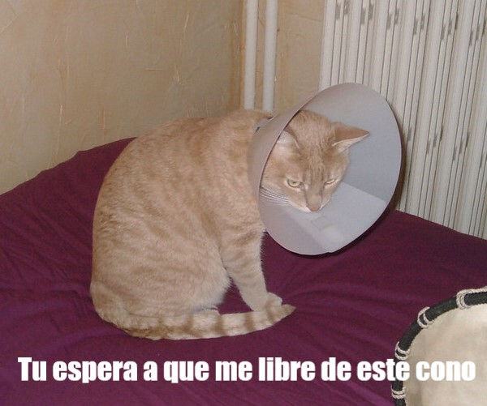

## Lo que harás

En este recurso harás un generador de memes de gatos. Usando una imagen de tu gato, puedes crear tu propio meme de un gato para presumir ante tus amigos.

## Lo que aprenderás

Al crear un generador de memes de gato aprenderás:

- Cómo escribir funciones en JavaScript
- Cómo usar JavaScript para manipular la entrada de datos del usuario
- Cómo usar `oninput` y `onchange` para hacer que las cosas sucedan en vivo en una página web en respuesta a las acciones del usuario

Este recurso cubre elementos de los siguientes capítulos del [Raspberry Pi Digital Making Curriculum](https://www.raspberrypi.org/curriculum/){:target="_blank"}:

- [Diseña de elementos básicos en 2D y 3D ](https://www.raspberrypi.org/curriculum/design/creator){:target="_blank"}
- [Combina estructuras de programación para resolver un problema](https://www.raspberrypi.org/curriculum/programming/builder){:target="_blank"}
