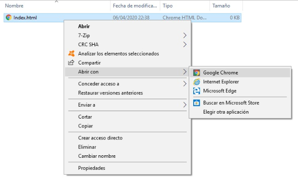

## Crea una página web

- Abre un archivo en blanco en el editor de texto que hayas elegido y guárdalo.

[[[generic-html-create-and-save]]]

- The HTML code below gives you the basic structure of a page. Copy and paste it into the file you created, then save the file. Keep the text editor open so you can edit the file.

  ```html
  <html>
  <head>
    <title>My page</title>
  </head>
  <body>
    My content here
  </body>
  </html>
  ```

- Go to the folder where you saved your webpage. Open the file with your internet browser as well, so you have the same file open in both your text editor and your browser.

  On Windows, you may need to right-click the file, choose `Open with`, and then select your internet browser.

  

  Whenever you change the code in your text editor, save it and then press the refresh button on your browser to see the updated page.
