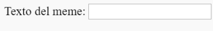

## Obteniendo la imagen y el texto

Queremos que las personas puedan usar su propia imagen y texto para crear el meme, por lo que necesitamos una forma para que puedan proporcionarlos. Vamos a añadir un formulario que nuestro usuario puede completar.

Si estás utilizando un archivo en tu ordenador, añade este código entre `<body>` y `</body>`. Si está usando CodePen, añade este código en la sección HTML.

- Añade las etiquetas `<form>`, que indican el inicio del formulario y `</form>`, que indican el final del mismo.

    ```html
    <form>
    </form>
    ```

- Dentro de tu `<form>`, añade un cuadro de texto para poder escribir el texto del meme:

  ```html
  <form>
  Texto del meme: <input type="text" id="user_text" maxlength="70"><p>
  </form>
  ```

- Guarda el código y actualiza el navegador para ver el cuadro que has creado.

    

- Añade código para crear otro cuadro de entrada (input) en la línea por debajo del primero. Esta vez, el cuadro de entrada no será un cuadro de texto, sino un cuadro especial para seleccionar la imagen para el meme. El tipo de entrada debe ser `file` (archivo), y el nombre de la entrada debe ser `user_picture`.

--- hints ---


--- hint --- 
Èsto es lo que hace el código que ya has escrito:

  * `input` dice que estamos creando una forma para que el usuario proporcione algunos datos
  * `type = "text"` dice que los datos serán texto
  * `id = "user_text"` le da a este cuadro en particular un nombre o ID, es más o menos como un nombre de variable
  * `maxlength = "70"` es opcional: le impide al usuario escribir más de 70 letras para que su texto no ocupe espacio más allá de la parte inferior de la imagen
  * La etiqueta `<p>` después del cuadro de entrada añade un párrafo (un poco de espacio antes del siguiente cuadro de entrada)

¿Puedes averiguar cómo crear otro cuadro de entrada utilizando esta información?

--- /hint ---

--- hint ---

Tendrás que cambiar las partes del código resaltadas con `***` continuación:

```html
Selecciona una imagen <input type="***" id="***"><p>
```

--- /hint ---

--- hint --- 
Aquí está el código que tienes que añadir:

```html
Selecciona una imagen <input type="file" id="user_picture"><p>
```
--- /hint ---

--- /hints ---

- Puede usar estos cuadros para escribir y seleccionar un archivo, pero todavía no sucederá nada. **Nota**: todas las imágenes se guardan en tu ordenador; este programa no sube nada a Internet.
