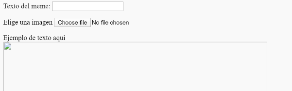
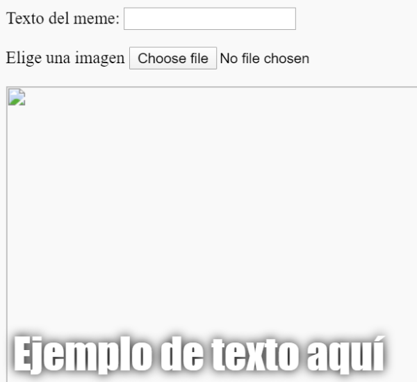

## Construye el meme

Necesitamos crear un área donde se mostrará el meme. Esta área comenzará en blanco porque cuando la página se carga por primera vez, no sabremos qué imagen o qué texto quiere usar la persona.

- Debajo de la etiqueta `</form>`, añade una nueva línea de código:

  ```html
  <div id="meme_text">Texto de ejemplo aquí</div>
  ```

  Éste es un elemento `<div>`: es un cuadro invisible que al final contendrá el texto para nuestro meme. Le hemos dado un `id` (identificador) igual que hicimos con los cuadros de entrada (input).

- Ahora añade otro `<div>` debajo del anterior:

  ```html
    <div id="meme_picture"></div>
    ```

    Dentro de este `<div>`, hay también otra etiqueta que muestra una imagen. `src=""` indica que imagen se mostrará. En este caso, hemos dejado la imagen en blanco, porque todavía no la ha proporcionado el usuario.

- Guardar y actualizar. La imagen será un cuadro en blanco y el texto de ejemplo se mostrará en la fuente predeterminada, que no es la mejor para un meme:

    

- Si estás utilizando un archivo en tu ordenador, busca la sección `<head>` en tu código y añade este código entre `<head>` y `</head>`. (Omite este paso si estás usando CodePen)

  ```html
  <style type="text/css">
</style>
  ```

- Pega el código siguiente entre las etiquetas `<style>` para dar a tu texto un estilo más de meme. Si estás usando CodePen, pégalo en la sección CSS.

    ```css
    #meme_text {
        background-color: transparent;
        font-size: 40px;
        font-family: "Impact";
        color: white;
        text-shadow: black 0px 0px 10px;
        width: 600px;
        position: absolute;
        left: 15px;
        top: 400px;
    }
    ```

  Las líneas `left: 15px` y `top: 400 px` determinan cómo de lejos de la izquierda y la parte superior de la página aparecerá el texto. Si quieres puedes modificar estos números para que el texto aparezca en un lugar diferente en tu meme. Si quieres saber más sobre los estilos CSS, visita la [referencia de CSS de w3schools](http://www.w3schools.com/CSSref/){:target="_blank"}.

  
