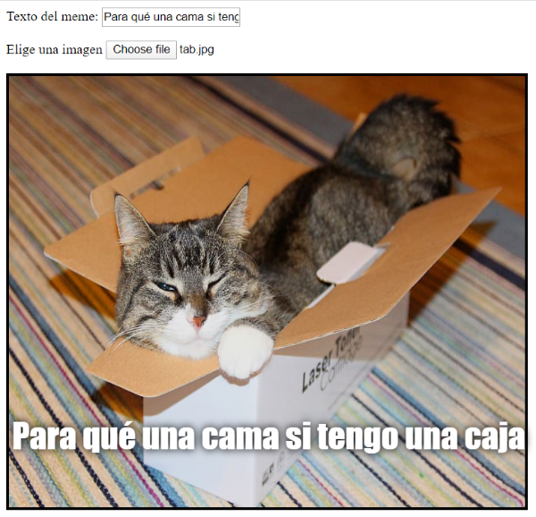

## Muestra la imagen

Ahora vamos a escribir código para coger la imagen del gato que el usuario ha seleccionado y mostrarla en el meme.

- Define una nueva función JavaScript llamada `update_image`. Ten cuidado y escribe este código después de la llave de cierre `}` de la función que creaste antes.

[[[generic-javascript-create-a-function]]]

- Dentro de la función `update_image`, crea dos nuevas variables:

    ```javascript
    var img = document.querySelector('img');
    ```

    Esta primera variable selecciona la primera (¡y única!) etiqueta `` del documento para que podamos indicar a la página dónde mostrar la imagen seleccionada.

    ```javascript
    var file = document.querySelector('input[type=file]').files[0];
    ```

    Esta segunda variable apunta al archivo con la imagen del gato seleccionada.

- Establece la etiqueta de imagen (img) para que contenga la imagen que el usuario ha subido:

    ```javascript
    img.src =  window.URL.createObjectURL(file);
    ```

- Ahora añade código para decirle al input (entrada) del archivo que llame a la función `update_image()` `onchange` cuando alguien selecciona un archivo.

--- hints ---


--- hint --- Recuerda que, en el paso anterior, llamabas a la función `update_text()` cuando se introducía texto nuevo en el cuadro de entrada `user_text`. Utilizando lo que ya has aprendido, ¿Puedes averiguar cómo llamar a la función `update_image()` cuando el usuario selecciona un archivo en el cuadro de entrada `user_file`?
--- /hint ---


--- hint --- Necesitarás añadir `onchange=""` y luego reemplazar el `***` con la función que te gustaría llamar:
```javascript
Selecciona una imagen <input type="file" id="user_picture" onchange="***">
```
--- /hint ---

--- hint --- Encuentra la línea de código para el cuadro de entrada (input) del archivo y añade `onchange="update_image()"` así:
```html
Selecciona una imagen <input type="file" id="user_picture" onchange="update_image()">
```

--- /hint ---

--- /hints ---

- Guarda y actualiza la página. Si tu código funciona, cuando selecciones una imagen usando el cuadro de entrada **Elige una imagen**, esa imagen debe aparecer en el cuadro de meme de abajo. Si también escribes algo en el cuadro de texto, tu texto meme debería aparecer encima de la imagen.


