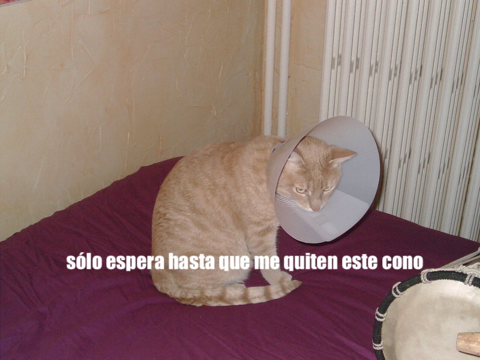

## Lo que harás

En este proyecto se creará un generador de memes para gatos. Usando una imagen de tu gato, puedes crear tu propio meme de gatos para presumir ante tus amigos.

## Lo que aprenderás

Al crear un generador de memes para gatos aprenderás:

- Cómo escribir funciones en JavaScript
- Cómo usar JavaScript para manipular la entrada de datos por un usuario
- Cómo usar `oninput` y `onchange` para hacer que las cosas sucedan en vivo en una página web en respuesta a las acciones del usuario

This resource covers elements from the following strands of the [Raspberry Pi Digital Making Curriculum](https://www.raspberrypi.org/curriculum/){:target="_blank"}:

- [Design basic 2D and 3D assets](https://www.raspberrypi.org/curriculum/design/creator){:target="_blank"}
- [Combina estructuras de programación básicas para resolver un problema](https://www.raspberrypi.org/curriculum/programming/builder){:target="_blank"}
