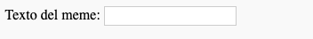

## Obteniendo la imagen y el texto

Queremos que las personas puedan usar su propia imagen y texto para crear el meme, por lo que necesitamos una forma para que puedan proporcionarlos. Agreguemos un formulario que nuestro usuario pueda completar.

Si estás usando un archivo en tu ordenador, pon este código entre `<body>` y `</body>`. Si estás usando CodePen, pon este código en la sección HTML.

- Agrega las etiquetas `<form>,` que indican el inicio del formulario y `</form>,` que indican el final del formulario.

    ```html
    <form>
    </form>
    ```

- Dentro de tu `<form>`, añade un cuadro de texto para que puedas escribir el texto del meme:

  ```html
  <form>
  Texto del meme: <input type="text" id="user_text" maxlength="70"><p>
  </form>
  ```

- Guarda tu código y actualiza tu navegador para ver la casilla que creaste.

    

- Agrega código para crear otra casilla de entrada en la línea debajo de tu primera casilla. Esta vez, la casilla de entrada no será una casilla de texto, sino una casilla especial para seleccionar el archivo de la imagen para el meme. El tipo de entrada debe ser `archivo`, y el nombre de la entrada debe ser `user_picture`.

--- hints ---

--- hint --- Esto es lo que hace el código que ya escribiste:

  * `input` dice que estamos creando una manera para que el usuario proporcione algunos datos
  * `type="text"` dice que los datos serán de texto
  * `id="user_text"` da a esta casilla un nombre o un ID, que se parece a un nombre de una variable
  * `maxlength="70"` es opcional - te impide escribir más de 70 letras para que tu texto no ocupe espacio más allá de la parte inferior de la imagen
  * La etiqueta

después de la casilla de entrada añade un párrafo (un poco de espacio antes de la siguiente casilla de entrada)</li> </ul>

¿Puedes averiguar cómo crear otra casilla de entrada usando esta información?

--- /hint ---

--- hint ---

Necesitarás cambiar las partes del código resaltadas con `***` a continuación:

```html
Selecciona una imagen <input type="***" id="***"><p>
```

--- /hint ---

--- hint --- Aquí está el código que necesitas añadir:

```html
Selecciona una imagen <input type="file" id="user_picture"><p>
```
--- /hint ---

--- /hints ---

- Puedes usar estas casillas para escribir y seleccionar un archivo, pero nada sucederá todavía. **Nota**: todas las imágenes se guardan en tu ordenador - este programa no carga nada a internet.
