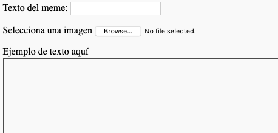
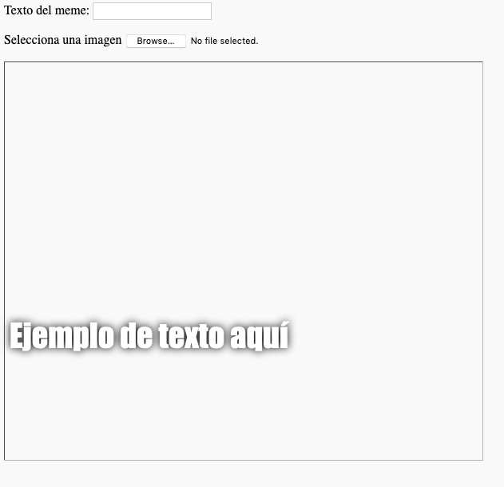

## Construye el meme

Necesitamos crear una área donde se mostrará el meme. Esta área comenzará en blanco porque cuando la página se carga por primera vez, no sabremos qué imagen o qué texto quiere usar la persona.

- Debajo de la etiqueta `</form>`, añade una nueva línea de código:

  ```html
  <div id="meme_text">Texto de ejemplo aquí</div>
  ```

  Este es un elemento 

<div>
  : es un cuadro invisible que al final contendrá el texto para nuestro meme. Le hemos dado una <code>id</code> igual como hicimos con los cuadros de input (entrada).</p></li> 
  
  <li>
    <p spaces-before="0">
      Ahora añade otro <code>&lt;div&gt;</code> debajo del anterior: 
      
      <pre><code class="html">    &lt;div id="meme_picture"&gt;&lt;img src="" height="500" width="600"&gt;&lt;/div&gt;
</code></pre>
    </p>
    
    <p spaces-before="4">
      Dentro de este <code>&lt;div&gt;</code>, hay también otra etiqueta que muestra una imagen. <code>src=""</code> indica que imagen se mostrará. En este caso, hemos dejado la imagen en blanco, porque todavía no tenemos la imagen del usuario.
    </p>
  </li>
  
  <li>
    <p spaces-before="0">
      Guarda y actualiza. La imagen será un cuadro en blanco y el texto de ejemplo se mostrará en la fuente predeterminada, lo que no es normal en un meme:
    </p>
    <p spaces-before="4">
      
    </p>
  </li>
  
  <li>
    <p spaces-before="0">
      Si estás utilizando un archivo en tu ordenador, busca la sección <code>&lt;head&gt;</code> en tu código y añade este código entre <code>&lt;head&gt;</code> y <code>&lt;/head&gt;</code>. (Omite este paso si estás usando CodePen) 
      
      <pre><code class="html">  &lt;style type="text/css"&gt;
  &lt;/style&gt;
</code></pre>
    </p>
  </li>
  
  <li>
    <p spaces-before="0">
      Pega el código debajo de las etiquetas <code>&lt;style&gt;</code> para dar a tu texto un estilo meme. Si estás usando CodePen, pégalo en la sección CSS. 
      
      <pre><code class="css">    #meme_text {
        background-color: transparent;
        font-size: 40px;
        font-family: "Impact";
        color: white;
        text-shadow: black 0px 0px 10px;
        width: 600px;
        position: absolute;
        left: 15px;
        top: 400px;
    }
</code></pre>
    </p>
    
    <p spaces-before="2">
      Las líneas de código <code>left: 15px</code> y <code>top: 400 px</code> determinan qué tan lejos de la izquierda y la parte superior de la página aparecerá el texto. Si quieres puedes modificar estos números para que el texto aparezca en un lugar diferente en tu meme. Si quieres saber más sobre los estilos CSS, visita la referencia <a href="http://www.w3schools.com/CSSref/">w3schools CSS</a>{:target="_blank"}.
    </p>
    <p spaces-before="2">
      
    </p>
  </li></ul>
