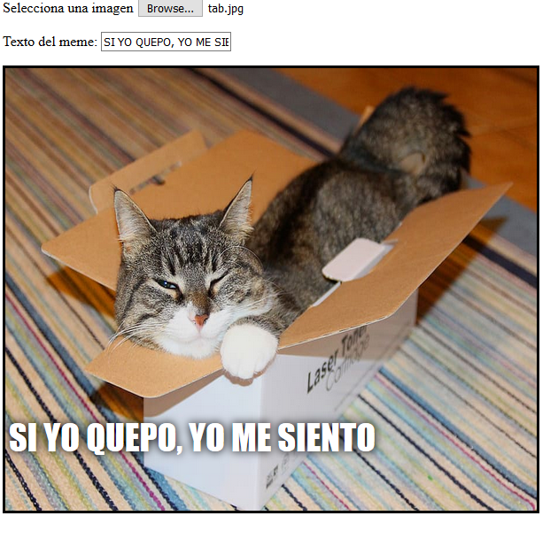

## Mostrar la imagen

Ahora vamos a escribir el código para tomar la imagen del gato que el usuario ha seleccionado y mostrarla en el meme.

- Define una nueva función JavaScript llamada `update_image`. Ten cuidado de escribir este código después del corchete de cierre `}` de la función anterior que creaste.

[[[generic-javascript-create-a-function]]]

- Dentro de la función `update_image`, crea dos nuevas variables:

    ```javascript
    var img = document.querySelector('img');
    ```

    Esta primera variable selecciona la primera (¡y la única!) etiqueta `` en el documento, para que podamos decirle a la página dónde mostrar la imagen seleccionada.

    ```javascript
    var file = document.querySelector('input[type=file]').files[0];
    ```

    Esta segunda variable apunta al archivo de imagen de gato seleccionada.

- Establecer la etiqueta de imagen para que contenga la imagen que el usuario ha subido:

    ```javascript
    img.src =  window.URL.createObjectURL(file);
    ```

- Ahora añade algo de código para decirle a la entrada del archivo que llame a la función `update_image()` `onchange` cuando alguien seleccione un archivo.

--- hints ---

--- hint --- Recuerda que, en el paso anterior, llamaste a la función `update_text()` cuando se escribió un nuevo texto en la casilla de entrada `user_text`. Usando lo que aprendiste antes, ¿puedes averiguar cómo llamar a la función `update_image()` cuando el usuario selecciona un archivo en la casilla de entrada `user_file`? --- /hint ---

--- hint --- Necesitarás añadir `onchange=""` y luego reemplazar el `***` con la función que te gustaría llamar:
```javascript
Selecciona una imagen <input type="file" id="user_picture" onchange="***">
```
--- /hint ---

--- hint --- Encuentra la línea de código para la casilla de entrada del archivo y añade `onchange="update_image()"` así:
```html
Selecciona una imagen <input type="file" id="user_picture" onchange="update_image()">
```

--- /hint ---

--- /hints ---

- Guarda y actualiza la página. Si tu código está funcionando, cuando selecciones una imagen usando el la casilla de entrada **Selecciona una imagen**, esa imagen debe aparecer en el cuadro del meme de abajo. Si también escribes algo en la casilla de texto, tu texto meme debería aparecer encima de la imagen.


