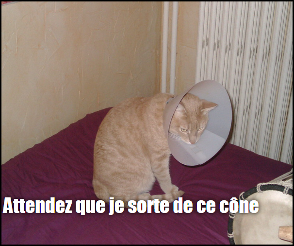

## Ce que tu feras

Dans cette ressource, tu vas créer un générateur de mèmes de chat. En utilisant une image de ton chat, tu peux créer ton propre mème de chat pour le montrer à tes amis.

## Ce que tu vas apprendre

En créant un générateur de mèmes de chat, tu apprendras :

- Comment écrire des fonctions en JavaScript
- Comment utiliser JavaScript pour manipuler la saisie de données par un utilisateur
- Comment utiliser `oninput` et `onchange` pour que les choses se produisent en direct sur une page Web en réponse aux actions des utilisateurs

Ce projet couvre les éléments des sections suivantes du [Programme Raspberry Pi de création numérique](https://www.raspberrypi.org/curriculum/){:target="_blank"} :

- [Concevoir des éléments de base en 2D et 3D](https://www.raspberrypi.org/curriculum/design/creator){:target="_blank"}
- [Combiner des constructions de programmation pour résoudre un problème](https://www.raspberrypi.org/curriculum/programming/builder){: target = "_ blank"}
