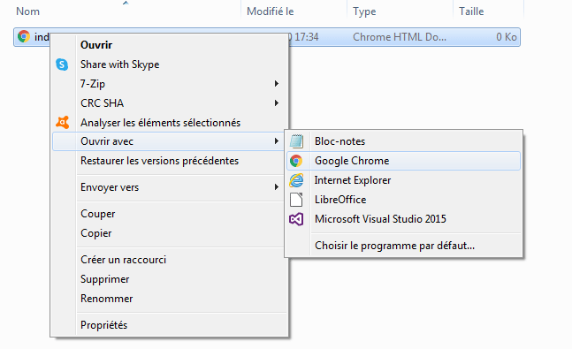

## Créer une page Web

- Ouvre un fichier vierge dans l'éditeur de texte que tu as choisi et enregistre le fichier.

[[[generic-html-create-and-save]]]

- Le code HTML ci-dessous te donne la structure de base d'une page. Copie et colle-le dans le fichier que tu as créé, puis enregistre le fichier. Garde l'éditeur de texte ouvert pour pouvoir modifier le fichier.

  ```html
  <html>
  <head>
    <title>Ma page</title>
  </head>
  <body>
    Mon contenu ici
  </body>
  </html>
  ```

- Va dans le dossier dans lequel tu as enregistré ta page Web. Ouvre également le fichier avec ton navigateur Internet, afin d'avoir le même fichier ouvert dans ton éditeur de texte et ton navigateur.

  Sous Windows, tu devras peut-être cliquer avec le bouton droit sur le fichier, choisir `Ouvrir avec`, puis sélectionner ton navigateur Internet.

  

  Chaque fois que tu modifies le code dans ton éditeur de texte, enregistre-le, puis appuie sur le bouton d'actualisation de ton navigateur pour voir la page mise à jour.
