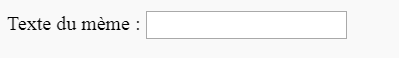

## Obtenir l'image et le texte

Nous voulons que les gens puissent utiliser leur propre image et leur propre texte pour faire le mème, donc nous avons besoin d'un moyen de les fournir. Ajoutons un formulaire que notre utilisateur peut remplir.

Si tu utilises un fichier sur ton ordinateur, mets ce code entre `<body>` et `</body>`. Si tu utilises CodePen, mets ce code dans la section HTML.

- Ajoute les balises `<form>,` qui indique le début du formulaire et `</form>,` qui indique la fin du formulaire.

    ```html
    <form>
    </form>
    ```

- Dans ton `<form>`, ajoute une zone de texte afin que tu puisses taper le texte du mème :

  ```html
  <form>
  Texte du mème : <input type="text" id="user_text" maxlength="70"><p>
  </form>
  ```

- Enregistre ton code et actualise ton navigateur pour voir la zone que tu as créée.

    

- Ajoute du code pour créer une autre zone de saisie sur la ligne située sous ta première zone. Cette fois, la zone de saisie ne sera pas une zone de texte, mais une zone spéciale pour sélectionner le fichier image pour le mème. Le type d'entrée doit être `fichier` et le nom de l'entrée doit être `user_picture`.

--- hints ---

Voici ce que fait le code que tu as déjà écrit :

  * `input` indique que nous créons un moyen pour l'utilisateur de fournir des données
  * `type="text"` indique que les données seront du texte
  * `id="user_text"` donne à cette zone particulière un nom ou un ID, un peu comme un nom de variable
  * `maxlength="70"` est facultatif - il t'empêche de taper plus de 70 lettres afin que ton texte n'occupe pas d'espace après le bas de l'image
  * La balise `<p>` après la zone de saisie ajoute un paragraphe (un peu d'espace avant la zone de saisie suivante)

Peux-tu déterminer comment créer une autre zone de saisie à l'aide de ces informations ?

--- /hint ---

--- hint ---

Tu devras modifier les parties du code mises en évidence par `***` ci-dessous :

```html
Sélectionne une image <input type="***" id="***"><p>
```

--- /hint ---

Voici le code que tu dois ajouter :

```html
Sélectionne une image <input type="file" id="user_picture"><p>
```
--- /hint ---

--- /hints ---

- Tu peux utiliser ces zones pour taper et sélectionner un fichier, mais rien ne se passera encore. **Remarque** : toutes les images sont conservées sur ton ordinateur - ce programme ne télécharge rien sur Internet.
