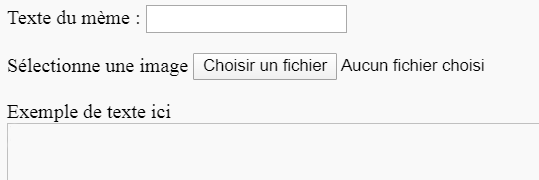
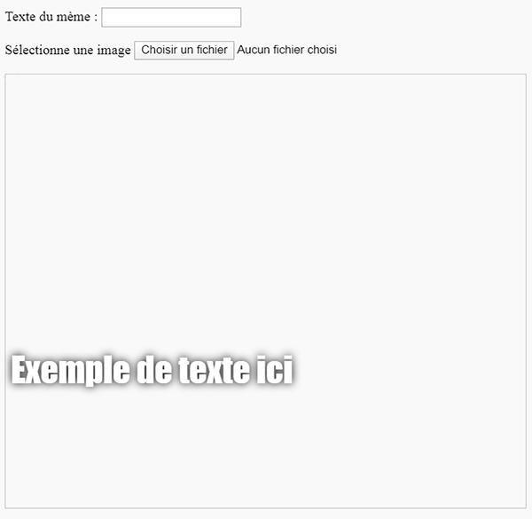

## Construire le mème

Nous devons créer une zone où le mème sera affiché. Cette zone commencera vierge car lors du premier chargement de la page, nous ne saurons pas quelle image ou quel texte la personne souhaite utiliser.

- Sous la balise `</form>`, ajoute une nouvelle ligne de code:

  ```html
  <div id="meme_text">Exemple de texte ici</div>
  ```

  Ceci est un élément `<div>` - c'est une zone invisible qui contiendra éventuellement le texte de notre mème. Nous lui avons donné un `id` tout comme nous l'avons fait pour les zones de saisie.

- Ajoute maintenant un autre `<div>` en dessous du précédent:

  ```html
    <div id="meme_picture"></div>
    ```

    À l'intérieur de ce `<div>`, il y a aussi une autre balise qui affiche une image. `src=""` indique quelle image afficher. Dans ce cas, nous avons laissé l'image vide, car nous n'avons pas encore l'image de l'utilisateur.

- Enregistre et actualise. L'image sera une zone vierge et l'exemple de texte s'affichera dans la police par défaut, qui n'est pas très semblable à un mème:

    

- Si tu utilises un fichier sur ton ordinateur, recherche la section `<head>` dans ton code et ajoute ce code entre `<head>` et `</head>`. (Ignore cette étape si tu utilises CodePen.)

  ```html
  <style type="text/css">
  </style>
  ```

- Colle le code ci-dessous entre les balises `<style>` pour donner à ton texte un style mème. Si tu utilises CodePen, colle ce code dans la section CSS.

    ```css
    #meme_text {
        background-color: transparent;
        font-size: 40px;
        font-family: "Impact";
        color: white;
        text-shadow: black 0px 0px 10px;
        width: 600px;
        position: absolute;
        left: 15px;
        top: 400px;
    }
    ```

  Les lignes `left: 15px` et `top: 400px` déterminent la distance entre le texte et le haut de la page. Tu peux modifier ces chiffres pour faire apparaître le texte à un endroit différent sur ton mème si tu le souhaites. Si tu souhaites en savoir plus sur les styles CSS, visite la [référence CSS de w3schools](http://www.w3schools.com/CSSref/){:target="_blank"}.

  
