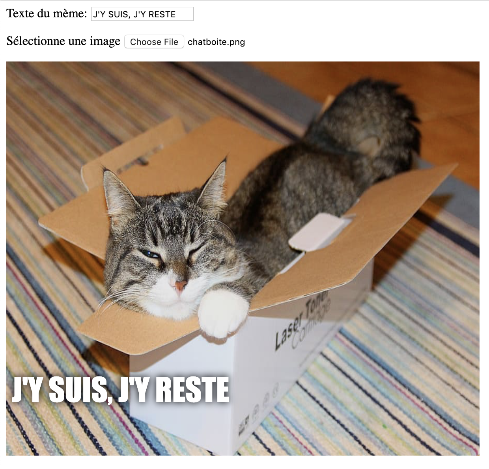

## Afficher l'image

Nous allons maintenant écrire du code pour prendre l'image de chat que l'utilisateur a sélectionnée et l'afficher sur le mème.

- Définis une nouvelle fonction JavaScript appelée `update_image`. Veille à taper ce code après la fermeture de l'accolade `}` de la fonction précédente que tu as créée.

[[[generic-javascript-create-a-function]]]

- À l'intérieur de la fonction `update_image`, crée deux nouvelles variables :

    ```javascript
    var img = document.querySelector('img');
    ```

    Cette première variable sélectionne la première (et seule !) balise `` dans le document, afin que nous puissions indiquer à la page où afficher l'image sélectionnée.

    ```javascript
    var file = document.querySelector('input[type=file]').files[0];
    ```

    Cette deuxième variable pointe vers le fichier image de chat sélectionné.

- Définis la balise image pour qu'elle contienne l'image que l'utilisateur a téléchargée :

    ```javascript
    img.src =  window.URL.createObjectURL(file);
    ```

- Ajoute maintenant du code pour dire à l'entrée du fichier d'appeler la fonction `update_image()` `onchange` quand quelqu'un sélectionne un fichier.

--- hints ---

N'oublie pas qu'à l'étape précédente, tu as appelé la fonction `update_text()` lorsqu'un nouveau texte a été écrit dans la zone de saisie `user_text` . En utilisant ce que tu as appris alors, peux-tu déterminer comment appeler la fonction `update_image()` lorsque l'utilisateur sélectionne un fichier dans la zone de saisie `user_file` ? --- /hint ---

Tu dois ajouter `onchange=""` et ensuite remplacer le ` *** ` avec la fonction que tu souhaites appeler :
```javascript
Sélectionne une image <input type="file" id="user_picture" onchange="***">
```
--- /hint ---

Recherche la ligne de code pour la zone de saisie de fichier et ajoute `onchange="update_image()"` comme ceci :
```html
Sélectionne une image <input type="file" id="user_picture" onchange="update_image()">
```

--- /hint ---

--- /hints ---

- Enregistre et actualise la page. Si ton code fonctionne, lorsque tu sélectionnes une image à l'aide de la zone de saisie ** Sélectionne une image **, cette image devrait apparaître dans la zone mème ci-dessous. Si tu tapes également quelque chose dans la zone de texte, le texte de ton mème devrait apparaître en haut de l'image.


