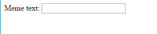

## चित्र और पाठ प्राप्त करना

हम चाहते हैं कि लोग मज़ेदार चित्र (meme) बनाने के लिए अपने स्वयं के चित्र और पाठ का उपयोग करने में सक्षम हों इसलिए हमें इन्हें प्रदान करने के लिए एक समाधान की आवश्यकता है। आइए एक ऐसा फॉर्म (form) जोड़ें जिसे हमारा उपयोगकर्ता (user) भर सकता हैं।

यदि आप अपने कंप्यूटर से फ़ाइल का उपयोग कर रहे हैं तो इस कोड को `<body>` और `</body>` के बीच रखें । यदि आप CodePen का उपयोग कर रहे हैं तो इस कोड को HTML के भाग में रखें।

- फॉर्म की शुरुआत को जताने के लिए यह टैग्स (tags) जोड़ें `<form>,` और फॉर्म के अंत को जताने के लिए, यह टैग्स जोड़ें, `</form>,` |

    ```html
    <form>
    </form>
    ```

- अपने `<form>` के अंदर, एक टेक्स्ट बॉक्स (text box) जोड़ें ताकि आप मज़ेदार चित्र (meme) टेक्स्ट टाइप कर सकें:

  ```html
  <form>
  Meme text: <input type="text" id="user_text" maxlength="70"><p>
  </form>
  ```

- अपने कोड को सेव (save) करें और अपने ब्राउज़र में आपके द्वारा बनाए गए बॉक्स को देखने के लिए रिफ्रेश (refresh) करें।

    

- अपने पहले बॉक्स के नीचे लाइन पर एक और इनपुट (input) बॉक्स बनाने के लिए कोड जोड़ें। इस बार इनपुट बॉक्स एक टेक्स्ट बॉक्स (text box) नहीं होगा, लेकिन एक विशेष बॉक्स होगा जिसमे हमें मज़ेदार चित्र (meme) के लिए एक चित्र का चयन करना होगा । यह इनपुट `file` के प्ररूप में होने चाहिए और इस इनपुट का नाम `user_picture` होना चाहिए |

--- hint ---

--- संकेत --- आइये देखते हैं की आपके द्वारा लिखा गया कोड क्या करता है:

  * `input` यह कहता है कि हम उपयोगकर्ता (user) के लिए कुछ डेटा प्रदान करने का एक तरीका बना रहे हैं
  * `type="text"` यह कहता है कि डेटा (data) पाठ (text) होगा
  * `id="user_text"` इस विशेष बॉक्स को एक नाम या आईडी (ID) देता है, कही ना कही यह एक वेरिएबल नाम (variable name) के जैसा है
  * `maxlength="70"` वैकल्पिक है - यह आपको 70 से अधिक अक्षरों को टाइप करने से रोकता है ताकि आपका पाठ चित्र के निचले भाग में जगह न ले
  * इनपुट बॉक्स के बाद `<p>` टैग (tag) एक अनुच्छेद (paragraph) जोड़ता है (अगले इनपुट बॉक्स से पहले थोड़ी सी जगह)

क्या आप इस जानकारी का उपयोग करके एक और इनपुट बॉक्स (input box) बनाने का काम कर सकते हैं?

--- /hint ---

--- hint ---

आपको नीचे दिए गए कोड में `***` दिए गए भागो को बदला होगा:

```html
एक चित्र चुनें <input type="***" id="***"><p>
```

--- /hint ---

--- hint --- यहाँ आपको जोड़ने के लिए आवश्यक कोड है:

```html
एक चित्र चुनें <input type="file" id="user_picture"><p>
```
--- /hint ---

--- /hints ---

- आप इन बक्सों को टाइप करने के लिए और एक फ़ाइल को चुनने के लिए उपयोग कर सकते हैं, लेकिन अभी तक कुछ भी नहीं होगा। ** ध्यान दें**: सभी चित्र आपके कंप्यूटर पर रखे गए हैं | यह प्रोग्राम इंटरनेट पर कुछ भी अपलोड (upload) नहीं करता है।
