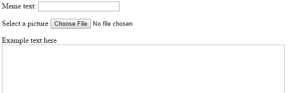

## मज़ेदार चित्र (meme) को बनाएं

हमें एक ऐसा क्षेत्र बनाने की ज़रुरत है जहां मज़ेदार चित्र (meme) को प्रदर्शित किया जाएगा। यह क्षेत्र शुरुआत में खाली रहेगा क्योंकि जब पेज पहले लोड होता है तो हम यह नहीं जान सकते कि उपयोगकर्ता (user) किस चित्र या पाठ का उपयोग करना चाहते हैं।

- नया कोड इस `</form>` टैग (tag) के नीचे जोड़े:

  ```html
  <div id="meme_text">Example text here</div>
  ```

  यह एक `<div>` तत्व है | यह एक अदृश्य बॉक्स है जिसमें अंत हमारे मज़ेदार चित्र (meme) के लिए पाठ होगा। हमने इसे एक `id` दिया है ठीक वैसे ही जैसे हमने इनपुट बॉक्सेस को दिया था।

- आइये अब एक और `<div>` जोड़ें पिछले वाले के नीचे:

  ```html
    <div id="meme_picture"></div>
    ```

    इस `<div>` के अंदर एक और टैग (tag) भी है जो एक चित्र दिखाता है। `src=""` यह जताता है कि किस चित्र को दिखाना चाहिए | इस मामले में हमने चित्र को खाली छोड़ दिया है क्योंकि हमारे पास अभी तक उपयोगकर्ता (user) से चित्र नहीं है।

- सहेजें (save) और रिफ्रेश (refresh) करें। चित्र अभी एक खाली बॉक्स जैसा होगा और हमें उदहारण के तौर पर जो पाठ है वो डिफ़ॉल्ट फ़ॉन्ट (default font) में दिखेगा जो फिलहाल बहुत मज़ेदार नहीं लगेगा:

    

- यदि आप अपने कंप्यूटर के फ़ाइल का उपयोग कर रहे हैं तो अपने कोड में `<head>` अनुभाग ढूंढें और इस कोड को `<head>` और `</head>` के बीच में जोड़ें | (यदि आप CodePen का उपयोग कर रहे हैं तो इस चरण को छोड़ दें।)

  ```html
  <style type="text/css">
  </style>
  ```

- अपने पाठ (text) को एक मज़ेदार अंदाज़ देने के लिए नीचे दिए गए कोड को `<style>` टैग्स (tags) के बीच में चिपकाएं (paste) यदि आप CodePen का उपयोग कर रहे हैं तो इस कोड को CSS के भाग में चिपकाएं (paste)

    ```css
    #meme_text {
        background-color: transparent;
        font-size: 40px;
        font-family: "Impact";
        color: white;
        text-shadow: black 0px 0px 10px;
        width: 600px;
        position: absolute;
        left: 15px;
        top: 400px;
    }
    ```

  यह `left: 15px` और `top: 400px` लाइन्स यह निर्धारित करती हैं कि पाठ (text) बाईं ओर और पेज के शीर्ष से कितना दूर है। यदि आप चाहें तो पाठ को अपने मज़ेदार चित्र (meme) पर एक अलग स्थान पर प्रदर्शित करने के लिए इन संख्याओं को बदल सकते हैं। यदि आप CSS शैलियों के बारे में और जानना चाहते हैं तो यहाँ क्लिक करें [w3schools CSS reference](http://www.w3schools.com/CSSref/){:target="_blank"}.

  
