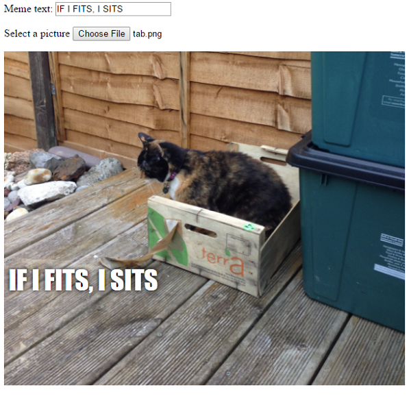

## चित्र को दिखाएं

अब हम कुछ और कोड लिखेंगे ताकी उपयोगकर्ता (user) ने जो बिल्ली का चित्र चुना है वो उनके मज़ेदार चित्र (meme) के ऊपर दिखाई दें |

- एक नया जावास्क्रिप्ट फ़ंक्शन (JavaScript function) को परिभाषित करें जिसे हम `update_image` कहेंगे । ध्यान रहे कि आप इस कोड को पिछले फंक्शन (function) के घुंगराले कोष्ठक (curly bracket) `}` को बंद करने के बाद ही टाइप करें |

[[[generic-javascript-create-a-function]]]

- `update_image` फंक्शन (function) के अंदर दो नए वेरिएबल्स (variables) बनाएं:

    ```javascript
    var img = document.querySelector('img');
    ```

    यह पहला वेरियबल (variable) दस्तावेज़ (document) में सिर्फ पेहले (और केवल!) `` टैग (tag) को चुनता है ताकि हम पेज को बता सके कि जो चुनी गयी चित्र है वो कहा दिखनी चाहिए।

    ```javascript
    var file = document.querySelector('input[type=file]').files[0];
    ```

    यह दूसरा वेरियबल (variable) बिल्ली के चित्र वाली फ़ाइल की ओर इशारा करता है।

- उपयोगकर्ता (user) द्वारा अपलोड की गई तस्वीर को शामिल करने के लिए चित्र टैग (image tag) सेट करें:

    ```javascript
    img.src =  window.URL.createObjectURL(file);
    ```

- अब आपको कुछ और कोड जोड़ना होगा ताकी अगर कोई एक फाइल को चुनें तो वो `update_image()` फंक्शन (function) को `onchange` में बदल दें

--- hints ---

--- hint --- याद रखें कि पिछले चरण में आपने `update_text()` फ़ंक्शन (function) को बुलाया था जब नया पाठ (text) `user_text` इनपुट बॉक्स (input box) में लिखा गया था | आपने जो सीखा है उसका उपयोग करके क्या आप एक `update_image()` फंक्शन (function) को बुलाने के लिए प्रोग्राम कर सकते है जब एक उपयोगकर्ता (user) एक फाइल को `user_file`इनपुट बॉक्स से चुनता है? --- /hint ---

--- hint --- आपको `onchange=""` को जोड़ने की आवश्यकता होगी और फिर `***` को उस फंक्शन (function) से बदले जिसे आप बुलाना चाहेंगे:
```javascript
एक चित्र चुनें <input type="file" id="user_picture" onchange="***">
```
--- /hint ---

--- hint --- फ़ाइल इनपुट बॉक्स (file input box) के लिए कोड की विशिष्ट लाइन का पता लगाएं और `onchange="update_image()"` को इस तरह जोड़ें:
```html
एक चित्र चुनें <input type="file" id="user_picture" onchange="update_image()">
```

--- /hint ---

--- /hints ---

- पेज को सहेजें (save) और रिफ्रेश (refresh) करें। यदि आपका कोड काम कर रहा है, तो जब आप **Select a picture** इनपुट बॉक्स (input box) का उपयोग करके एक चित्र चुनते है तो वह तस्वीर नीचे मज़ेदार चित्र (meme) के बॉक्स में दिखाई देना चाहिए। यदि आप टेक्स्ट बॉक्स (text box) में कुछ भी टाइप करते हैं, तो आपका मज़ेदार टेक्स्ट तस्वीर के ऊपर दिखाई देना चाहिए।


