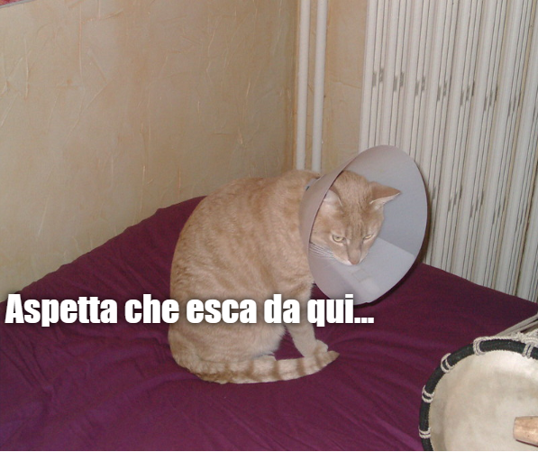

## Che cosa creerai

In questo progetto creerai un generatore di meme con i gatti. Usando un'immagine del tuo gatto, puoi creare il tuo meme con i gatti da mostrare ai tuoi amici.

## Che cosa imparerai

Creando un generatore di meme con i gatti imparerai:

- Come scrivere funzioni in JavaScript
- Come utilizzare JavaScript per manipolare l'immissione dei dati da parte di un utente
- Come utilizzare `oninput` e `onchange` per far accadere cose in tempo reale su una pagina Web in risposta alle azioni dell'utente

Questo progetto include elementi tratti dalle seguenti componenti del [Digital Making Curriculum di Raspberry Pi](https://www.raspberrypi.org/curriculum/){:target="_blank"}:

- [Risorse base di progettazione 2D e 3D](https://www.raspberrypi.org/curriculum/design/creator){:target="_blank"}
- [Combinare i costrutti di un linguaggio di programmazione per risolvere un problema](https://www.raspberrypi.org/curriculum/programming/builder){:target="_blank"}
