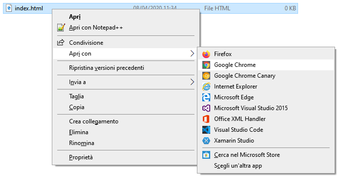

## Creare una pagina Web

- Apri un file vuoto nell'editor di testo che hai scelto e salva il file.

[[[generic-html-create-and-save]]]

- Il codice HTML qui sotto fornisce la struttura di base di una pagina. Copialo e incollalo nel file che hai creato, quindi salva il file. Tieni aperto l'editor di testo in modo da poter modificare il file.

  ```html
  <html>
  <head>
    <title>La mia pagina</title>
  </head>
  <body>
    Il mio contenuto
  </body>
  </html>
  ```

- Vai alla cartella in cui hai salvato la tua pagina web. Apri il file anche con il tuo browser Internet, in modo da avere lo stesso file aperto sia nell'editor di testo che nel browser.

  Su Windows, potrebbe essere necessario fare clic con il pulsante destro del mouse sul file, scegliere `Apri con`, quindi selezionare il browser Internet.

  

  Ogni volta che modifichi il codice nell'editor di testo, salvalo e premi il pulsante di aggiornamento sul browser per visualizzare la pagina aggiornata.
