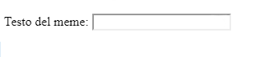

## Ottenere l'immagine e il testo

Vogliamo che le persone siano in grado di utilizzare la propria immagine e il proprio testo per creare il meme, quindi abbiamo bisogno di un modo per fornirli. Aggiungiamo un modulo che il nostro utente può compilare.

Se stai utilizzando un file sul tuo computer, inserisci questo codice tra `<body>` e `</body>`. Se stai usando CodePen, inserisci questo codice nella sezione HTML.

- Aggiungi i tag `<form>,` che indicano l'inizio del modulo e `</form>,` che indicano la fine del modulo.

    ```html
    <form>
    </form>
    ```

- All'interno di `<form>`, aggiungi una casella di testo in modo da poter digitare il testo del meme:

  ```html
  <form>
  Testo del meme: <input type="text" id="user_text" maxlength="70"><p>
  </form>
  ```

- Salva il codice e aggiorna il browser per vedere la casella che hai creato.

    

- Aggiungi il codice per creare un'altra casella di input sulla riga sotto la tua prima casella. Questa volta la casella di input non sarà una casella di testo, ma una casella speciale per selezionare il file immagine per il meme. Il tipo di input dovrebbe essere `file` e il nome dell'input dovrebbe essere `user_picture`.

--- hints ---

--- hint --- Ecco cosa fa il codice che hai già scritto:

  * `input` dice che stiamo creando un modo per l'utente di fornire alcuni dati
  * `type="text"` dice che i dati saranno testo
  * `id="user_text""` dà a questa particolare casella un nome o un ID, un po' come un nome di variabile
  * `maxlength="70"` è facoltativo: ti impedisce di digitare più di 70 lettere in modo che il testo non occupi spazio oltre la parte inferiore dell'immagine
  * Il tag `<p>` dopo la casella di input aggiunge un paragrafo (un po' di spazio prima della casella di input successiva)

Riesci a capire come creare un'altra casella di input utilizzando queste informazioni?

--- /hint ---

--- hint ---

Dovrai cambiare le parti del codice evidenziate con `***` qui sotto:

```html
Scegli un'immagine <input type="***" id="***"><p>
```

--- /hint ---

--- hint --- Ecco il codice che devi aggiungere:

```html
Scegli un'immagine <input type="file" id="user_picture"><p>
```
--- /hint ---

--- /hints ---

- È possibile utilizzare queste caselle per digitare e scegliere un file, ma non accadrà ancora nulla. **Nota**: tutte le immagini sono conservate sul tuo computer - questo programma non carica nulla in Internet.
