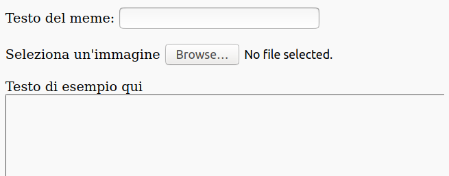
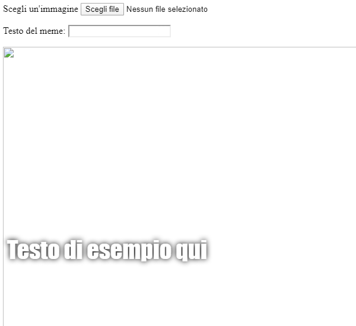

## Costruire il meme

Dobbiamo creare un'area in cui verrà visualizzato il meme. Questa area partirà con uno spazio vuoto perché quando la pagina si carica per la prima volta, non sapremo quale immagine o quale testo la persona vuole utilizzare.

- Sotto il tag `</form>`, aggiungi una nuova riga di codice:

  ```html
  <div id="meme_text">Testo di esempio qui</div>
  ```

  Questo è un elemento `<div>` - è un riquadro invisibile che alla fine conterrà il testo per il nostro meme. Gli abbiamo dato un `id` proprio come abbiamo fatto per le caselle di input.

- Ora aggiungi un altro `<div>` sotto quello precedente:

  ```html
    <div id="meme_picture"></div>
    ```

    All'interno di questo `<div>`, c'è anche un altro tag che mostra un'immagine. `src=""` indica quale immagine visualizzare. In questo caso, abbiamo lasciato l'immagine vuota, perché non abbiamo ancora l'immagine dall'utente.

- Salva e aggiorna. L'immagine sarà una casella vuota e il testo di esempio verrà visualizzato nel font predefinito, che non è molto in stile meme:

    

- Se stai utilizzando un file sul tuo computer, trova la sezione `<head>` nel tuo codice e aggiungi questo codice tra `<head>` e `</head>`. (Salta questo passaggio se stai usando CodePen.)

  ```html
  <style type="text/css">
</style>
  ```

- Incolla il codice qui sotto tra i tag `<style>` per stilizzare il tuo testo come un meme. Se stai usando CodePen, incollalo nella sezione CSS.

    ```css
    #meme_text {
        background-color: transparent;
        font-size: 40px;
        font-family: "Impact";
        color: white;
        text-shadow: black 0px 0px 10px;
        width: 600px;
        position: absolute;
        left: 15px;
        top: 400px;
    }
    ```

  Le linee `left: 15px` e `top: 400px` determinano la distanza del testo da sinistra e dalla parte superiore della pagina. Puoi modificare questi numeri per far apparire il testo in una posizione diversa sul tuo meme, se lo desideri. Se desideri saperne di più sugli stili CSS, visita il [riferimento CSS di w3schools](http://www.w3schools.com/CSSref/){:target="_ blank"}.

  
