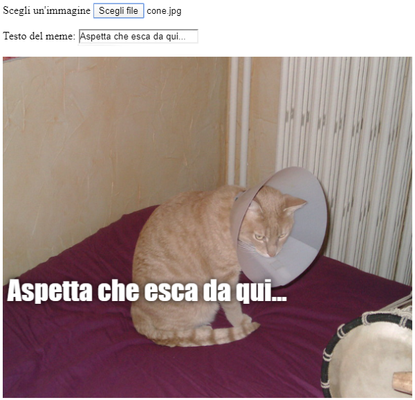

## Mostra l'immagine

Ora scriveremo del codice per acquisire l'immagine del gatto che l'utente ha selezionato e visualizzarla sul meme.

- Definisci una nuova funzione JavaScript chiamata `update_image` ("aggiorna immagine"). Fai attenzione a digitare questo codice dopo la parentesi graffa di chiusura `}` della funzione precedente che hai creato.

[[[generic-javascript-create-a-function]]]

- All'interno della funzione `update_image`, crea due nuove variabili:

    ```javascript
    var img = document.querySelector('img');
    ```

    Questa prima variabile seleziona il primo (e unico!) tag `` nel documento, in modo che possiamo dire alla pagina dove visualizzare l'immagine selezionata.

    ```javascript
    var file = document.querySelector('input[type=file]').files[0];
    ```

    Questa seconda variabile punta al file scelto con l'immagine del gatto.

- Imposta il tag dell'immagine per contenere l'immagine che l'utente ha caricato:

    ```javascript
    img.src =  window.URL.createObjectURL(file);
    ```

- Ora aggiungi un po' di codice per dire all'input di tipo file di chiamare la funzione `update_image()` `onchange` quando qualcuno sceglie un file.

--- hints ---


--- hint --- Ricorda che, nel passaggio precedente, hai chiamato la funzione `update_text()` quando è stato scritto il nuovo testo nella casella di input `user_text`. Usando ciò che hai imparato, riesci a capire come chiamare la funzione `update_image()` quando l'utente seleziona un file nella casella di input `user_file`?
--- /hint ---


--- hint --- Dovrai aggiungere `onchange=""` e sostituire `***` con la funzione che vorresti chiamare:
```javascript
Scegli un'immagine <input type="file" id="user_picture" onchange="***">
```
--- /hint ---

--- hint --- Trova la riga di codice per la casella di input del file e aggiungi `onchange="update_image()"` così:
```html
Scegli un'immagine <input type="file" id="user_picture" onchange="update_image()">
```

--- /hint ---

--- /hints ---

- Salva e aggiorna la pagina. Se il tuo codice funziona, quando selezioni un'immagine usando la casella di input **Scegli un'immagine**, quell'immagine dovrebbe apparire nel box del meme sottostante. Se si digita anche qualcosa nella casella di testo, il testo del tuo meme dovrebbe apparire sovrapposta all'immagine.


