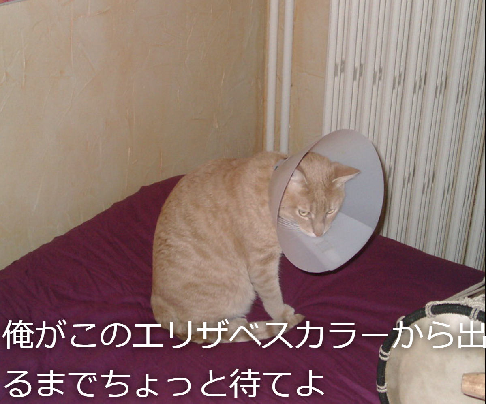

## 作るもの

この教材では、猫のミームジェネレーターを作成します。 猫の画像を使用して、自分の猫のミームを作成し、友達に自慢することができます。

## あなたが学ぶもの

猫ミームジェネレータを作成することにより、次のことを学ぶことができます：

- JavaScriptで関数を記述する方法
- JavaScriptを使用してユーザーが入力したデータを操作する方法
- ユーザーのアクションに応じて、Webページ上に変化を起こすための `oninput` および `onchange` を使用する方法

このリソースは、 [Raspberry Piデジタル・メイキング・カリキュラム](https://www.raspberrypi.org/curriculum/){:target="_blank"}の次の要素をカバーします：

- [基本的な2Dおよび3Dアセットを設計する](https://www.raspberrypi.org/curriculum/design/creator){:target="_blank"}
- [問題を解決するためにプログラミング構造を組み合わせる](https://www.raspberrypi.org/curriculum/programming/builder){:target="_blank"}
