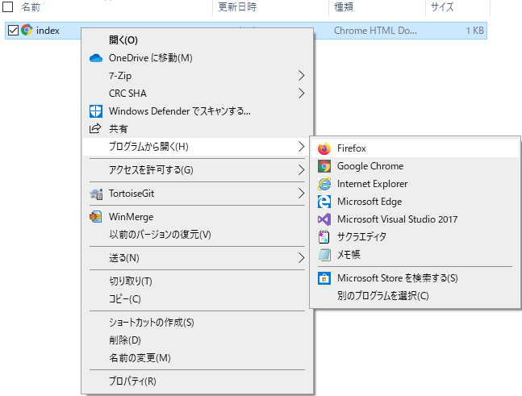

## Webページを作成する

- いずれかのテキストエディターで空のファイルを開き、ファイルを保存します。

[[[generic-html-create-and-save]]]

- 以下のHTMLコードは、ページの基本構造を示しています。 作成したファイルにコピーして貼り付け、ファイルを保存します。 テキストエディタを開いたままにして、ファイルを編集できるようにします。

  ```html
  <html>
  <head>
    <title>マイページ</title>
  </head>
  <body>
    ここにマイコンテンツ
  </body>
  </html>
  ```

- Webページを保存したフォルダーに移動します。 インターネットブラウザーでもファイルを開いて、テキストエディターとブラウザーの両方で同じファイルを開きます。

  Windowsでは、ファイルを右クリックし、`プログラムから開く`を選択して、インターネットブラウザを選択する必要がある場合があります。

  

  テキストエディターでコードを変更するたびに、コードを保存し、ブラウザーの更新ボタンを押して、更新されたページを表示します。
