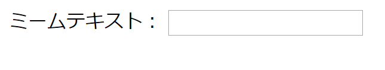

## 画像とテキストを取得する

ミームを作るために、ユーザが持っている写真とテキストを使えるようにしたいので、それを入力する方法が必要です。 ユーザーが入力できるフォームを追加しましょう。

あなたがコンピュータ上のファイルを使用している場合は、 `<body>` と`</body>`の間にこのコードを配置します。 CodePenを使用している場合は、このコードをHTMLセクションに配置します。

- `<form>` タグを追加してください。これはフォームの開始を示します。 `</form>` はフォームの終了を示します。

    ```html
    <form>
    </form>
    ```

- `<form>`中にテキストボックスを追加して、ミームテキストを入力できるようにします。

  ```html
  <form>
  ミームテキスト： <input type="text" id="user_text" maxlength="70"><p>
  </form>
  ```

- コードを保存し、ブラウザーを更新して、作成したボックスを表示します。

    

- 最初のボックスの下の行に別の入力ボックスを作成するコードを追加します。 今回は、入力ボックスはテキストボックスではなく、ミームの画像ファイルを選択するための特別なボックスになります。 入力タイプは `file`で、入力の名前は `user_picture`である必要があります。

--- hints ---

--- hint --- ここで記述したコードの意味は次のとおりです。

  * `input` は、ユーザーがデータを提供する方法を作成していることを示します
  * `type="text"` は、データがテキストであることを示します
  * `id="user_text"` は、この特定のボックスに変数名のような名前またはIDを付けます。
  * `maxlength="70"` はオプションです-70文字を超えて入力するのを防ぎ、テキストが画像の下部を超えてスペースを取らないようにします
  * 入力ボックスの後の `<p>` タグは段落を追加します（次の入力ボックスの前に少しスペースを取ります）

この情報を使用して別の入力ボックスを作成する方法を理解できますか？

--- /hint ---

--- hint ---

以下の `***` 強調表示されているコードの部分を変更する必要があります。

```html
画像を選択 <input type="***" id="***"><p>
```

--- /hint ---

--- hint --- 追加する必要があるコードは次のとおりです。

```html
画像を選択 <input type="file" id="user_picture"><p>
```
--- /hint ---

--- /hints ---

- これらのボックスを使用して文字の入力およびファイルを選択できますが、まだ何も起こりません。 **注**：すべての画像はコンピュータに保存されます-このプログラムはインターネットに何もアップロードしません。
