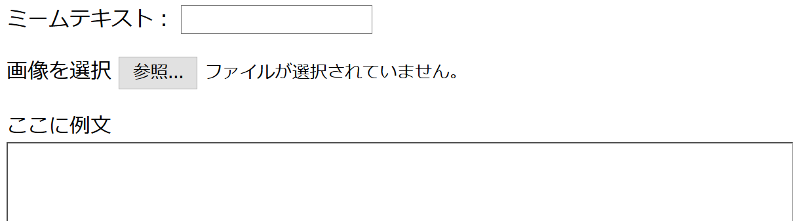
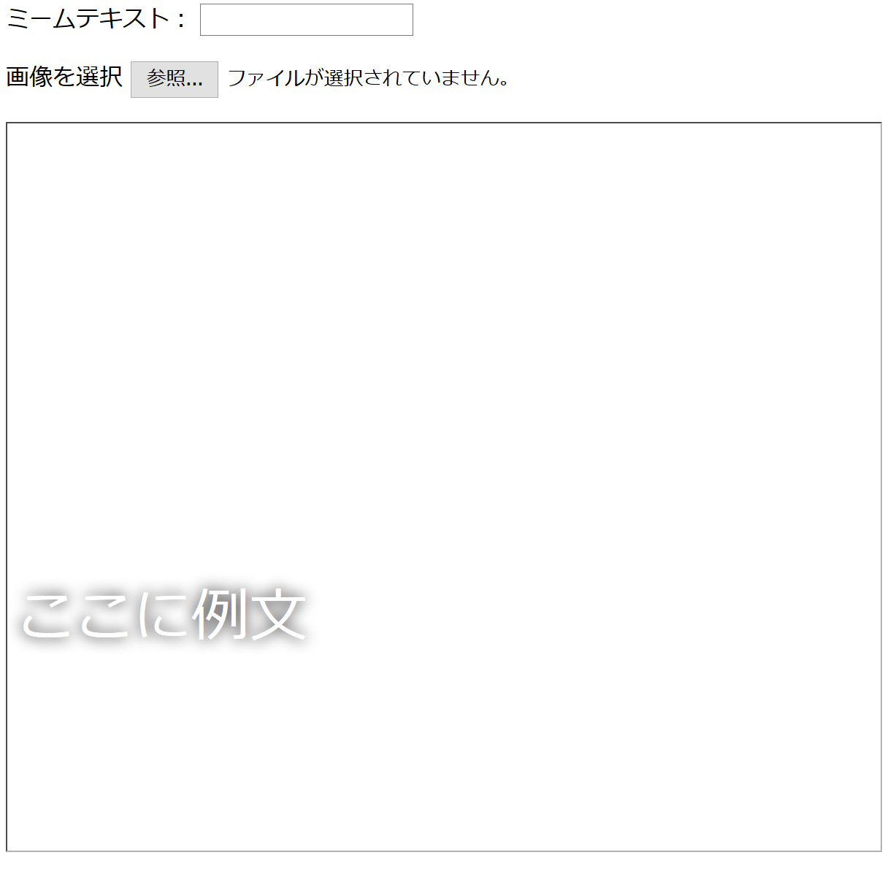

## ミームを構築する

ミームを表示する領域を作成する必要があります。 ページが最初に読み込まれたとき、ユーザーが使用したい画像やテキストがわからないため、この領域は空白で始まります。

- `</form>`タグの下に、新しいコード行を追加します：

  ```html
  <div id="meme_text">ここに例文</div>
  ```

  これは`<div>`要素です-最終的に私たちのミームのテキストを保持する非表示のボックスです。 We have given it an `id` just like we did to the input boxes.

- Now add another `<div>` below the previous one:

  ```html
    <div id="meme_picture"></div>
    ```

    Inside this `<div>`, there's also another tag which displays an image. `src=""` indicates which image to display. In this case, we've left the image blank, because we don't yet have the picture from the user.

- Save and refresh. The picture will be a blank box and the example text will display in the default font, which isn't very meme-like:

    

- If you're using a file on your computer, find the `<head>` section in your code and add this code between `<head>` and `</head>`. (Skip this step if you're using CodePen.)

  ```html
  <style type="text/css">
  </style>
  ```

- Paste the code below between the `<style>` tags to give your text a meme style. If you're using CodePen, paste it into the CSS section.

    ```css
    #meme_text {
        background-color: transparent;
        font-size: 40px;
        font-family: "Impact";
        color: white;
        text-shadow: black 0px 0px 10px;
        width: 600px;
        position: absolute;
        left: 15px;
        top: 400px;
    }
    ```

  The `left: 15px` and `top: 400px` lines determine how far the text is from the left and the top of the page. You can alter these numbers to make the text appear in a different place on your meme if you like. If you would like to know more about CSS styles, visit the [w3schools CSS reference](http://www.w3schools.com/CSSref/){:target="_blank"}.

  
