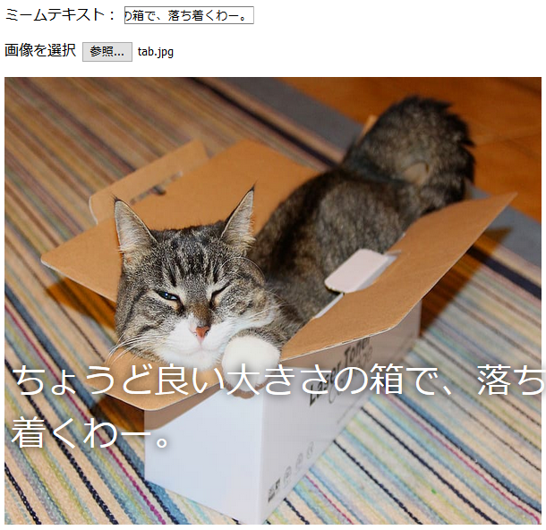

## 画像を表示する

次に、ユーザーが選択した猫の画像を取得してミームに表示するコードを記述します。

- `update_image`という新しいJavaScript関数を定義します 。 以前に作成した関数の閉じ中括弧`}`の後にこのコードを入力するように注意してください。

[[[generic-javascript-create-a-function]]]

- ` update_image`関数の中に、2つの新しい変数を作成します。

    ```javascript
    var img = document.querySelector('img');
    ```

    この最初の変数は、ドキュメント内の最初の（そして唯一の！）``タグを選択します。これにより、選択した画像を表示する場所をページに伝えることができます。

    ```javascript
    var file = document.querySelector('input[type=file]').files[0];
    ```

    この2番目の変数は、選択した猫の画像ファイルを指します。

- ユーザーがアップロードした写真を含むようにイメージタグを設定します。

    ```javascript
    img.src =  window.URL.createObjectURL(file);
    ```

- 次に、誰かがファイルを選択したとき `onchange`イベントで 、`update_image()`関数を呼び出すように指示するコードを追加します。

--- hints ---

--- hint --- 前のステップで、新しいテキストが`user_text`入力ボックスに書き込まれたときに関数`update_text()`を呼び出したことを思い出してください。 そのとき学んだことを使用して、ユーザーが`user_file`入力ボックスでファイルを選択したとき、関数`update_image()`を呼び出す方法を理解できますか？ --- /hint ---

--- hint --- `onchange=""`を追加する必要があります。そして、`***`を呼び出したい関数で置き換えます：
```javascript
画像を選択 < input type="file" id="user_picture" onchange="***">
```
--- /hint ---

--- hint --- ファイル入力ボックスのコード行を見つけて、`onchange＝"update_image()"`を追加します：
```html
画像を選択 < input type="file" id="user_picture" onchange="update_image()">
```

--- /hint ---

--- /hints ---

- ページを保存して更新します。 コードが機能している場合、**画像を選択**入力ボックスをで画像を選択すると、その画像が下のミームボックスに表示されます。 テキストボックスにも何かを入力すると、ミームテキストが画像の上に表示されます。


