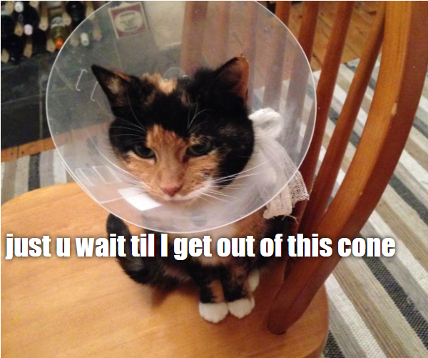

## 만들 작품

이 자료에서는 고양이 밈 생성기를 만들 것입니다. 마음에 드는 고양이 사진을 골라 당신만의 고양이 밈을 만들고 친구들에게 자랑해 볼 수도 있겠죠!

## 배우게 될 것

당신이 이 프로젝트를 진행하며 배울 수 있는 것은 다음과 같습니다:

- JavaScript로 함수를 작성하는 방법
- JavaScript를 사용하여 사용자가 입력한 데이터를 조작하는 방법
- `oninput` 및 `onchange` 을 사용하여 사용자의 행동에 따라 실시간으로 웹 페이지가 반응하도록 만드는 방법

이 자료는 [Raspberry Pi 디지털 제작 커리큘럼](https://www.raspberrypi.org/curriculum/){:target="_blank"}중 아래의 과정에 있는 요소들을 다룹니다:

- [2D와 3D 디자인](https://www.raspberrypi.org/curriculum/design/creator){:target="_blank"}
- [프로그래밍 구성요소를 결합하여 문제 해결하기](https://www.raspberrypi.org/curriculum/programming/builder){: target = "_ blank"}
