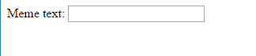

## 그림과 텍스트 얻기

우리는 사람들이 각자의 그림과 텍스트를 사용하여 밈을 만들게 할 수 있게 하기 위해 그들이 그림과 텍스트를 우리에게 줄 수 있는 방법이 필요합니다. 사용자가 작성할 수 있는 양식을 추가하겠습니다.

컴퓨터에서 파일을 사용하는 경우 이 코드를 `<body>`와 `</body>`사이에 넣으십시오. CodePen을 사용하는 경우 이 코드를 HTML 섹션에 넣으십시오.

- 양식의 시작을 나타내는 `<form>`과 양식의 끝을 나타내는 `</form>` 태그를 추가하십시오.

    ```html
    <form>
    </form>
    ```

- `<form>`안에 meme 텍스트를 입력할 수 있도록 텍스트 상자를 추가하십시오.

  ```html
  <form>
  밈 텍스트: <input type="text" id="user_text" maxlength="70"><p>
  </form>
  ```

- 추가한 텍스트 상자를 보려면 코드를 저장하고 브라우저를 새로고침 하십시오.

    

- 첫 번째 상자 아래에 또 다른 입력 상자를 만들기 위해 코드를 추가하십시오. 이번에는 입력 상자가 텍스트 상자가 아니라 밈의 이미지 파일을 선택하는 특별한 상자입니다. type은 `file`이어야 하고 입력 이름은 `user_picture`이어야합니다.

--- 힌트 ---

--- 힌트 --- 다음은 이미 작성한 코드의 기능입니다.

  * `input` 은 사용자가 데이터를 제공할 수 있는 방법을 만드는 것입니다.
  * `type ="text"` 은 입력 데이터가 텍스트임을 나타냅니다.
  * `id="user_text"`는 이 특정 상자에 변수명과 같은 이름 또는 ID를 지정합니다.
  * `maxlength ="70"` 은 선택 사항입니다. 70 자 이상 입력할 수 없게 하여 텍스트가 이미지 영역을 넘지 않게 합니다.
  * 입력 상자 뒤의 `<p>` 태그는 단락(다음 입력 상자 앞의 약간의 공간)을 추가합니다.

이 정보를 사용하여 다른 입력 상자를 만드는 방법을 알아낼 수 있습니까?

--- /힌트 ---

--- 힌트 ---

아래의 `***` 강조 표시된 코드 부분을 변경해야합니다.

```html
사진을 선택하세요 <input type="***" id="***"><p>
```

--- /힌트 ---

--- 힌트 --- 추가해야 할 코드는 다음과 같습니다.

```html
사진을 선택하세요 <input type="file" id="user_picture"><p>
```
--- /힌트 ---

--- /힌트 ---

- 이 상자를 사용하여 파일을 입력하고 선택할 수 있지만 아직 아무 일도 일어나지 않습니다. **참고**: 모든 이미지는 컴퓨터에 보관됩니다. 이 프로그램은 인터넷에 아무 것도 업로드하지 않습니다.
