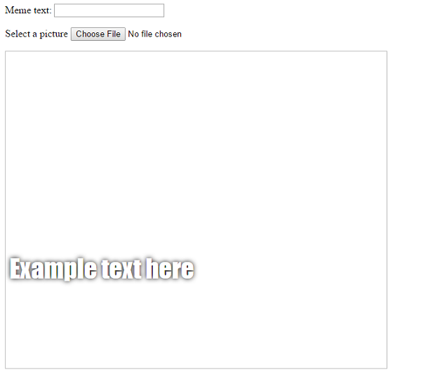

## 밈 만들기

우리는 밈이 보여질 공간을 만들어야 합니다. 이 공간은 처음에는 비어있을 것입니다. 왜냐하면 페이지가 처음 로드되었을 때 우리는 사용자가 어떤 사진이나 텍스트를 사용하고 싶은지 모르기 때문이죠.

- `</form>` 태그 아래에 다음과 같은 몇 줄의 코드를 입력하세요:

  ```html
  <div id="meme_text">예시 텍스트를 입력하세요</div>
  ```

  이것은 `<div>` 요소입니다. 우리의 밈을 위해 사용자가 지정한 텍스트를 보여주게 될 투명한 상자라고 할 수 있죠. 우리는 이것에게 `id` 를 지정해 주었습니다. 우리가 input 박스에게 그랬듯이 말이죠.

- 위에서 만든 div 요소 아래에 새로운 `<div>` 를 하나 더 만들어 줍시다.

  ```html
    <div id="meme_picture"></div>
    ```

    이 `<div>` 안에는 이미지를 보여주기 위해 쓰이는 또 다른 태그가 하나 들어있습니다. `src=""` 는 어떤 이미지를 사용자에게 보여줄 지 명시하는 역할을 합니다. 지금 당장은 이미지를 빈 칸으로 남겨두었습니다. 아직은 사용자로부터 이미지를 받지 못했기 때문이죠.

- 저장하고 새로고침해보세요. 사진은 빈 상자일 것이며 예제 텍스트는 기본 글꼴로 표시될 것입니다. 전반적으로 우리가 아는 밈과는 다른 모습입니다.

    

- 만약 당신이 컴퓨터에 있는 파일을 이용해서 이 프로젝트를 진행하고 계신다면, `<head>`를 코드에서 찾은 후 아래의 코드를 `<head>`와 `</head>`사이에 넣어주세요. (만약 당신이 CodePen을 이용하고 계신다면 이 단계는 건너뛰어도 좋습니다.)

  ```html
  <style type="text/css">
  </style>
  ```

- 당신의 텍스트에 밈과 같은 스타일을 연출하기 위해서 `<style>` 태그 사이에 아래의 코드를 붙여넣어주세요. 만약 당신이 CodePen을 이용하고 있다면, 아래의 코드를 CSS 섹션에 붙여넣으시면 됩니다.

    ```css
    #meme_text {
        background-color: transparent;
        font-size: 40px;
        font-family: "Impact";
        color: white;
        text-shadow: black 0px 0px 10px;
        width: 600px;
        position: absolute;
        left: 15px;
        top: 400px;
    }
    ```

  `left: 15px` 과 `top: 400px` 는 텍스트가 웹 페이지의 왼쪽과 위쪽에서 얼마나 떨어져 있을지를 결정하는 코드입니다. 저 숫자들을 바꾼다면 텍스트를 다른 위치에서 나타나게 할 수 있습니다. CSS 를 조작하는 방법에 대해서 더 알고 싶으시다면 [w3schools CSS reference](http://www.w3schools.com/CSSref/){:target="_blank"}에 방문해보세요.

  
