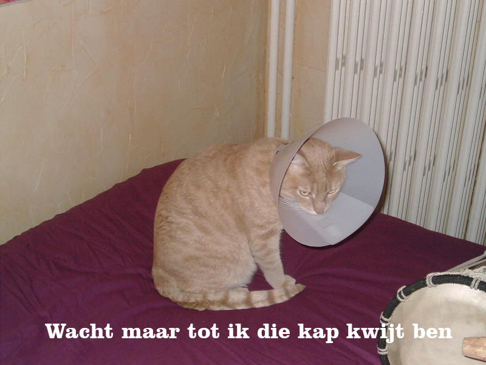

## Wat ga je maken?

In dit project maak je een katten meme-generator. Met behulp van een afbeelding van je kat kun je je eigen katten-meme maken om te delen met je vrienden.

## Wat ga je leren

Door een katten meme-generator te maken, leer je:

- Functies schrijven in JavaScript
- JavaScript gebruiken om gegevensinvoer door een gebruiker te manipuleren
- Hoe gebruik je `oninput` en `onchange` om dingen live te laten gebeuren op een webpagina als reactie op gebruikersacties

Dit project omvat elementen uit de volgende onderdelen van het [Raspberry Pi Digital Making Curriculum](https://www.raspberrypi.org/curriculum/){:target="_blank"}:

- [Ontwerp standaard 2D- en 3D-items](https://www.raspberrypi.org/curriculum/design/creator){:target="_blank"}
- [Combineer programmeerconstructies om een probleem op te lossen](https://www.raspberrypi.org/curriculum/programming/builder){:target="_blank"}
