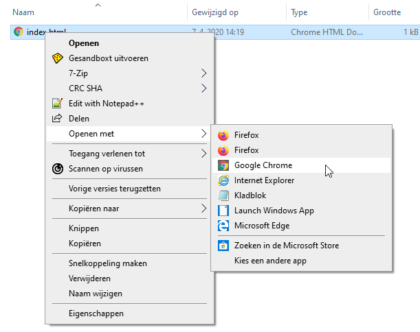

## Maak een webpagina

- Open een leeg bestand in de door jou gekozen teksteditor en sla het bestand op.

[[[generic-html-create-and-save]]]

- De onderstaande HTML-code geeft je de basisstructuur van een pagina. Kopieer en plak het in het bestand dat je hebt gemaakt en sla het bestand op. Houd de teksteditor open zodat je het bestand kunt bewerken.

  ```html
  <html>
  <head>
    <title>Mijn pagina</title>
  </head>
  <body>
    Mijn inhoud komt hier
  </body>
  </html>
  ```

- Ga naar de map waar je je webpagina hebt opgeslagen. Open het bestand ook met je internetbrowser, zodat je hetzelfde bestand open hebt staan in zowel je teksteditor als je browser.

  In Windows moet je mogelijk met de rechtermuisknop op het bestand klikken, `Openen met`kiezen en vervolgens je internetbrowser selecteren.

  

  Telkens wanneer je de code in je teksteditor wijzigt, sla je deze op en druk je vervolgens op de knop Vernieuwen in je browser om de bijgewerkte pagina te kunnen zien.
